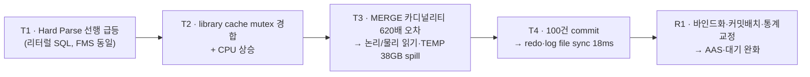

# 제4장. 성능진단 리포트 작성: 10대 지표 추출·판독과 종합진단

**단원 학습 목표**

1. `V$` 동적 성능 뷰와 `DBA_HIST_%` 이력 뷰에서 성능진단 10대 지표를 직접 추출하는 쿼리를 작성할 수 있다.
2. 각 지표를 정상 기준선(baseline)과 비교하여 정상·주의·위험을 판정하는 기준을 세울 수 있다.
3. 지표별 대표적인 오개념과 함정(결과 지표를 원인으로 오인하는 실수)을 회피할 수 있다.
4. 부하·활동 / 메모리 / I·O·효율 / 원인 SQL 네 그룹의 지표를 인과관계로 연결하여 병목의 전파 경로를 추적할 수 있다.
5. 현상→근거→원인→조치→검증 구조의 종합 성능진단 리포트를 작성할 수 있다.
6. TOP SQL을 지목하고 바인드 변수화·통계 교정·커밋 배치 등 구체적 최적화 방향을 우선순위와 함께 제안할 수 있다.

---

## 4.0 성능진단 리포트의 골격과 10대 지표 체계

### 1) 리포트는 왜 "지표 나열"이 아니라 "인과 논증"인가

성능진단 리포트의 목적은 지표를 예쁘게 정리하는 것이 아니라, **"무엇이 느린가 → 왜 느린가 → 무엇을 고치면 되는가"**를 증거로 논증하는 것입니다. 지표 수치를 아무리 많이 붙여도, 그 지표들이 하나의 원인으로 수렴하지 않으면 보고서가 아니라 대시보드 캡처에 불과합니다.

그래서 잘 쓴 리포트는 항상 네 부분으로 이어집니다.

1. **현상(Symptom)**: 언제, 무엇이, 얼마나 나빠졌는가 (사용자 체감·SLA 위반)
2. **지표별 상태(Evidence)**: 10대 지표를 기준선과 비교해 정상/주의/위험으로 판정
3. **핵심 진단과 우선순위(Root Cause)**: 지표를 인과로 엮어 근본 원인과 조치 순서를 결정
4. **원인 SQL과 최적화(Action)**: 부하를 유발한 SQL을 지목하고 개선안·검증 방법 제시

### 2) 10대 지표의 4그룹 체계

이 장에서 다루는 10대 지표(회장님 보고서 양식 기준)는 다음과 같이 네 그룹으로 묶입니다. 그룹은 곧 병목이 전파되는 **계층**입니다.

| 그룹 | 지표 | 성격 |
|---|---|---|
| **부하·활동** | ① CPU TIME ② DB Response Time ③ Wait Event(TOP10) ④ Session | 시스템이 지금 얼마나 바쁜가 |
| **메모리** | ⑤ SGA ⑥ PGA(Sort) | 메모리가 부하를 흡수하는가 |
| **I·O·효율** | ⑦ Logical/Physical Read ⑧ Parsing ⑨ Redo | 일을 효율적으로 하는가 |
| **원인 SQL** | ⑩ TOP SQL | 누가 부하를 만드는가 |

### 3) 판독의 두 가지 대원칙

**원칙 1 — 항상 기준선(baseline)과 비교하라.** 절대 수치 하나로는 정상 여부를 알 수 없습니다. "Hard Parse 100/s"는 그 자체로 위험이 아니라, **정상일 때 1.2/s였다면** 위험한 것입니다.

**원칙 2 — 결과 지표와 원인 지표를 구분하라.** 성능 문제에는 반드시 "증상을 보여주지만 원인은 아닌" 결과 지표가 있습니다.

$$\text{AAS} = \frac{\text{DB time}}{\text{elapsed time}} = \text{DB CPU AAS} + \text{Wait AAS}$$

AAS(평균 활성 세션)가 코어 수를 넘었다는 사실은 "시스템이 바쁘다"는 **결과**일 뿐, "CPU가 부족하다"는 **원인**이 아닙니다. 원인은 그 아래에 있는 Hard Parse, 카디널리티 오차, 잦은 commit 같은 지표에 있습니다. 이 구분을 못 하면 "CPU 증설"이라는 잘못된 처방으로 직행하게 됩니다.

### 4) 실습 데이터 배경 — PERFLAB 스냅샷

이 장의 모든 예시와 인터랙티브 실습은 다음 재현 데이터셋을 사용합니다.

| 구간 | 시간대 | 상태 |
|---|---|---|
| **B0** | 09:00~09:29 | 정상 기준선 |
| **T1** | 09:30~09:34 | 파싱 이상 (Hard Parse 선행 상승) |
| **T2** | 09:35~09:42 | CPU 과부하 |
| **T3** | 09:43~09:54 | PGA/TEMP·I/O 압박 |
| **T4** | 09:55~10:10 | Redo/commit 병목 |
| **R1** | 10:11~10:20 | 완화·회복 |

- 대상: `PERFLAB` PDB, 단일 서비스, 노드 2개(RAC 가정, node2는 학습용 파생), CPU 8코어
- 부하는 정산 배치가 라우팅된 **1번 노드에 편중**되어 있습니다.

> **주의:** 아래 임계치 숫자는 이 시나리오의 baseline(B0)에 맞춘 값입니다. 실제 시스템에서는 각자의 정상 기준선을 먼저 측정한 뒤 임계치를 세워야 합니다.

---

## 4.1 부하·활동 지표 (지표 ① ~ ④)

> **⚠️ 이 장의 SQL 예제 실행 환경 안내 (반드시 먼저 읽으세요)**
>
> - **DB 방언 표기:** 이 장의 진단 SQL은 별도 표기가 없으면 **Oracle 19c 기준**입니다. `V$`/`GV$` 동적 성능 뷰, `DBA_HIST_%` 이력 뷰, `DBMS_XPLAN` 패키지는 Oracle 전용이며, 필요한 곳에는 MySQL 8.0 / PostgreSQL 대응을 병기합니다(§4.7).
> - **라이선스:** `DBA_HIST_%`, `V$ACTIVE_SESSION_HISTORY`(ASH), `DBMS_XPLAN.DISPLAY_AWR` 등은 Oracle **Diagnostics Pack**(일부는 Tuning Pack) 라이선스가 있어야 사용할 수 있습니다.
> - **실행기 한계:** 이 워크스페이스의 인터랙티브 SQL 실습기는 브라우저에서 도는 **sql.js(SQLite WASM)**이므로, 위 Oracle 전용 문법은 **실행·자동채점되지 않습니다.** 이 장의 SQL은 "실행 버튼"용이 아니라 **판독 절차 학습용**이며, 실제 확인은 Oracle **비운영(테스트) 환경**에서 parse/권한/단위를 검증해야 합니다.
> - **시간 조건 원칙:** 구간 집계의 시간 조건은 경계 표본 이중계산을 막기 위해 항상 **반개구간 `[begin, end)`** 로 씁니다.

### 4.1.1 지표① CPU TIME

**진단 포인트** — Oracle이 실제로 CPU에서 연산한 시간(DB CPU)이 전체 활동에서 차지하는 비중과, OS 전체 CPU 사용률(Host CPU%)의 여유를 함께 본다.
**이상 시 영향** — CPU가 포화되면 실행 가능한(runnable) 세션이 런큐에 쌓여 모든 SQL의 응답시간이 동반 악화된다.
**개선·튜닝 방향** — CPU 자체 증설은 최후 수단. 대개는 CPU를 낭비하는 원인(Hard Parse, 비효율 실행계획)을 제거하는 것이 정답이다.

```sql
-- [실무 스크립트 4-1] DB CPU 시간과 CPU AAS (dialect: oracle)
-- (실시간 스냅샷: V$SYS_TIME_MODEL)
SELECT stat_name, ROUND(value/1e6, 1) AS seconds
FROM   v$sys_time_model
WHERE  stat_name IN ('DB CPU', 'DB time', 'background cpu time');
```

> ⚠️ 위 `V$SYS_TIME_MODEL` 값은 **기동 이후 누적치**입니다. 특정 구간의 CPU를 알려면 **두 시점의 차(델타)** 를 구해야 하며, 아래 이력 델타 쿼리를 사용합니다.

```sql
-- [실무 스크립트 4-1b] 이력 구간 델타로 DB CPU / DB time AAS 계산 (dialect: oracle)
-- 재기동·스냅샷 누락·RAC 혼입에 안전하도록 DBID + INSTANCE_NUMBER + STARTUP_TIME으로
-- 파티션한 뒤 LAG로 직전 보존 스냅샷과의 델타를 계산한다.
WITH x AS (
  SELECT s.dbid, s.instance_number, s.startup_time, s.snap_id,
         s.begin_interval_time, s.end_interval_time,
         t.stat_name, t.value,
         LAG(t.value) OVER (
           PARTITION BY s.dbid, s.instance_number, s.startup_time, t.stat_name
           ORDER BY s.snap_id) AS prev_value,
         LAG(s.end_interval_time) OVER (
           PARTITION BY s.dbid, s.instance_number, s.startup_time, t.stat_name
           ORDER BY s.snap_id) AS prev_end_time
  FROM   dba_hist_snapshot s
  JOIN   dba_hist_sys_time_model t
    ON   t.dbid = s.dbid
   AND   t.instance_number = s.instance_number
   AND   t.snap_id = s.snap_id
  WHERE  s.dbid = :dbid
    AND  s.instance_number = :inst_id
    AND  t.stat_name IN ('DB CPU', 'DB time')
), d AS (
  SELECT x.*,
         EXTRACT(DAY    FROM end_interval_time - prev_end_time)*86400
       + EXTRACT(HOUR   FROM end_interval_time - prev_end_time)*3600
       + EXTRACT(MINUTE FROM end_interval_time - prev_end_time)*60
       + EXTRACT(SECOND FROM end_interval_time - prev_end_time) AS elapsed_s
  FROM   x
)
SELECT snap_id, begin_interval_time, end_interval_time, stat_name,
       ROUND(elapsed_s, 0) AS elapsed_s,
       ROUND((value - prev_value)/1e6 / NULLIF(elapsed_s, 0), 2) AS aas
FROM   d
WHERE  prev_value IS NOT NULL   -- 각 파티션(=재기동 구간)의 첫 행은 델타 없음
  AND  value >= prev_value      -- 누적값 역전(재기동/초기화) 구간 배제
  AND  elapsed_s > 0
  AND  end_interval_time   > :begin_ts
  AND  begin_interval_time < :end_ts
ORDER  BY snap_id, stat_name;
```

**왜 `snap_id + 1`로 단순 연결하면 안 되는가**
- **재기동:** 기동 시 시간모델 누적값이 0으로 초기화된다. `STARTUP_TIME`을 파티션 키에 넣고 `value >= prev_value`로 역전 구간을 걸러야 음수 델타/거대값을 막는다.
- **DBID/인스턴스 혼입:** 서로 다른 DB(복제·DBID 변경)나 RAC의 다른 인스턴스 누적값을 빼면 무의미하다. `DBID + INSTANCE_NUMBER`를 함께 조인·파티션한다. RAC 합계는 **인스턴스별 델타를 먼저 구한 뒤 합산**한다.
- **스냅샷 누락:** 스냅샷이 빠지면 `snap_id`가 연속이 아니다. `LAG`는 직전 **보존된** 스냅샷을 가리키므로, 경과시간(`elapsed_s`)을 상수 1시간으로 가정하지 말고 **실제 `end_interval_time` 차이**로 계산해야 한다. 그래서 출력에 실제 시작/종료시각과 `elapsed_s`를 함께 낸다.
- **PDB 범위:** PDB별로 보려면 버전이 제공하는 `CON_DBID/CON_ID`를 조인·필터·파티션 키에 추가한다.

**판독 기준**

$$\text{DB CPU AAS} = \frac{\text{DB CPU 시간(s)}}{\text{경과 시간(s)}} \quad,\quad \text{CPU 사용률} \approx \frac{\text{DB CPU AAS}}{\text{코어 수}}$$

- Host CPU% — 주의 70% 이상, 위험 88% 이상 (B0 기준선 ≈ 29%)
- DB CPU AAS가 코어 수(8)에 근접하면 CPU 바운드 신호이지만, **단독으로 병목을 확정하지 않는다**.

**함정 / 오개념**
- Host CPU%는 OS 전체 사용률이며 Oracle 단독 사용량이 아니다. 다른 프로세스·백업이 섞일 수 있다.
- "AAS가 코어보다 크다 = CPU 병목"은 오류다. AAS는 CPU 대기 + 이벤트 대기의 합이므로, Wait AAS가 크면 CPU가 아니라 대기가 문제다.

### 4.1.2 지표② DB Response Time (DB Time)

**진단 포인트** — 전체 세션이 DB 안에서 소비한 총 시간(DB time)과, 그것을 시간으로 나눈 AAS. AAS를 CPU 성분과 대기 성분으로 분해하는 것이 핵심.
**이상 시 영향** — DB time이 늘면 처리량 대비 응답시간이 나빠져 사용자 체감 지연으로 직결된다.
**개선·튜닝 방향** — AAS 분해 결과 CPU가 크면 4.1.1로, Wait이 크면 4.1.3(대기 이벤트)로 진단을 넘긴다.

```sql
-- [실무 스크립트 4-2] AAS와 CPU/Wait 분해
SELECT ROUND(dbt.value/1e6,1)  AS db_time_s,
       ROUND(cpu.value/1e6,1)  AS db_cpu_s,
       ROUND((dbt.value-cpu.value)/1e6,1) AS wait_time_s
FROM   v$sys_time_model dbt, v$sys_time_model cpu
WHERE  dbt.stat_name = 'DB time' AND cpu.stat_name = 'DB CPU';
```

**판독 기준**
- AAS — 주의 6 이상, 위험 10 이상 (B0 ≈ 2.1)
- Wait AAS — 주의 2 이상, 위험 5 이상. 정합식 `AAS ≈ DB CPU AAS + Wait AAS`가 성립해야 한다.

**함정 / 오개념** — DB time 총량만 보고 "느리다"고만 말하는 것은 진단이 아니다. 반드시 CPU/Wait로 분해하고, 어느 그룹(4.1.3 대기)이 커졌는지까지 내려가야 한다. AAS는 대표적인 **결과 지표**이므로 근거로 단독 제시하면 감점 대상이다.

### 4.1.3 지표③ Wait Event (TOP 10)

**진단 포인트** — DB time에서 대기가 차지하는 비중과, 어떤 wait_class(Concurrency / User I/O / Commit 등)가 상위를 점유하는지.
**이상 시 영향** — 대기 이벤트의 성격이 곧 병목의 성격이다. `library cache: mutex X`가 상위면 파싱/동시성, `db file sequential read`면 I/O, `log file sync`면 커밋 문제다.
**개선·튜닝 방향** — 상위 이벤트의 wait_class에 맞춰 해당 지표 그룹으로 진단을 이관한다.

```sql
-- [실무 스크립트 4-3] TOP 대기 이벤트 (dialect: oracle, 실시간 누적: V$SYSTEM_EVENT)
-- ⚠️ time_waited_micro는 '기동 이후 누적치'다. 아래 pct는 '기동 이후 전체 대기 중 비율'일 뿐,
--    특정 장애 구간의 Top wait이 아니다. 구간 분석은 반드시 두 시점 델타(4-3b)를 써라.
SELECT event, wait_class, total_waits, time_waited_micro/1e6 AS time_s,
       ROUND(RATIO_TO_REPORT(time_waited_micro) OVER () * 100, 1) AS pct
FROM   v$system_event
WHERE  wait_class <> 'Idle'
ORDER  BY time_waited_micro DESC FETCH FIRST 10 ROWS ONLY;
```

```sql
-- [실무 스크립트 4-3b] 과거 구간의 Top wait: DBA_HIST_SYSTEM_EVENT 두 스냅샷 델타 (dialect: oracle)
-- 4-1b와 동일하게 DBID+INSTANCE_NUMBER+STARTUP_TIME 경계에서 LAG로 델타를 구한다.
WITH e AS (
  SELECT s.dbid, s.instance_number, s.startup_time, s.snap_id,
         s.begin_interval_time, s.end_interval_time,
         v.event_name, v.wait_class, v.time_waited_micro, v.total_waits,
         LAG(v.time_waited_micro) OVER (
           PARTITION BY s.dbid, s.instance_number, s.startup_time, v.event_name
           ORDER BY s.snap_id) AS prev_time_micro
  FROM   dba_hist_snapshot s
  JOIN   dba_hist_system_event v
    ON   v.dbid = s.dbid AND v.instance_number = s.instance_number
   AND   v.snap_id = s.snap_id
  WHERE  s.dbid = :dbid AND s.instance_number = :inst_id
    AND  v.wait_class <> 'Idle'
    AND  s.end_interval_time > :begin_ts AND s.begin_interval_time < :end_ts
)
SELECT event_name, wait_class,
       ROUND(SUM(time_waited_micro - prev_time_micro)/1e6, 1) AS delta_time_s
FROM   e
WHERE  prev_time_micro IS NOT NULL
  AND  time_waited_micro >= prev_time_micro   -- 재기동 역전 배제
GROUP  BY event_name, wait_class
ORDER  BY delta_time_s DESC FETCH FIRST 10 ROWS ONLY;
```

```sql
-- [실무 스크립트 4-3c] ASH 기반 활성세션 구성비 (dialect: oracle, Diagnostics Pack)
-- 분모를 WAITING만으로 잡지 말고 ON CPU + non-idle WAIT를 같은 활성 표본 분모로 집계한다.
-- 시간조건은 반개구간 [begin, end).
SELECT session_state, event,
       COUNT(*) AS active_samples,
       ROUND(COUNT(*) * 100 / SUM(COUNT(*)) OVER (), 1) AS active_pct
FROM   v$active_session_history
WHERE  sample_time >= TIMESTAMP '2026-07-15 09:55:00'
  AND  sample_time <  TIMESTAMP '2026-07-15 10:10:00'
  AND  (session_state = 'ON CPU'
        OR (session_state = 'WAITING' AND wait_class <> 'Idle'))
GROUP  BY session_state, event
ORDER  BY active_samples DESC FETCH FIRST 10 ROWS ONLY;
```

**판독 기준**
- `V$SYSTEM_EVENT`의 `pct`는 **기동 이후 누적 비율**이고, 4-3b의 `delta_time_s`가 **해당 구간의 실제 대기**다. 둘을 혼동하지 말 것.
- wait_class별 우선순위는 **% DB time**(대기 시간 / DB time)으로 매긴다.
- ASH의 `active_pct`는 "활성 표본 중 비율"이다. **WAITING만 분모로 잡은 비율은 "대기 내부 구성비"** 로 별도 명명하고 `% DB time`과 혼동하지 않는다.
- Concurrency(파싱·경합)와 User I/O(읽기)를 반드시 구분한다.

**함정 / 오개념** — 평균 대기시간(avg_wait_ms)이 낮아도 대기 횟수(waits)가 폭증하면 **총 대기시간은 크다**. 평균만 보지 말고 `waits × avg_wait_ms`(=총 대기)를 보라.

### 4.1.4 지표④ Session (활성 세션과 부하 귀속)

**진단 포인트** — 부하가 어떤 module/action/SQL에 귀속되는지, 그리고 RAC라면 어느 노드에 쏠렸는지.
**이상 시 영향** — 부하 귀속을 못 찾으면 원인 SQL(지표⑩)에 도달할 수 없다. 노드 편중을 놓치면 엉뚱한 노드를 튜닝한다.
**개선·튜닝 방향** — 부하를 유발한 module을 특정해 애플리케이션/배치 담당과 연결한다.

```sql
-- [실무 스크립트 4-4] ASH로 부하 귀속 파악 (dialect: oracle, Diagnostics Pack)
-- 시간조건은 반개구간 [begin, end)으로 경계 표본 이중계산을 막는다.
SELECT module, action, session_state, event, COUNT(*) AS samples
FROM   v$active_session_history
WHERE  sample_time >= TIMESTAMP '2026-07-15 09:30:00'
  AND  sample_time <  TIMESTAMP '2026-07-15 10:10:00'
GROUP  BY module, action, session_state, event
ORDER  BY samples DESC FETCH FIRST 15 ROWS ONLY;
```

> **`COUNT(*)`(=`samples`)의 의미 — 매우 중요**
> ASH의 `samples`는 **표본 개수**일 뿐 실행 횟수도, 대기 발생 횟수도 아니다. 각 표본은 표본 간격만큼의 **활동 시간을 대표**한다.
> - **메모리 ASH**(`V$/GV$ACTIVE_SESSION_HISTORY`)는 통상 약 **1초** 표본이므로 `AAS ≈ COUNT(*) / 경과초`로 근사할 수 있다.
> - **디스크 ASH**(`DBA_HIST_ACTIVE_SESS_HISTORY`)는 메모리 표본 전부가 아니라 통상 약 **10초 간격**으로 **일부만** 저장된다. 따라서 `COUNT(*) / 경과초`를 그대로 AAS로 쓰면 약 1/10로 **과소 계산**된다. 아래 4-4b처럼 각 저장 표본이 대표하는 시간으로 **가중**해야 한다.

```sql
-- [실무 스크립트 4-4b] 디스크 ASH(DBA_HIST_ASH)의 표본간격 보정 AAS (dialect: oracle)
-- 각 저장 표본이 대표하는 시간(USECS_PER_ROW)을 합산해 경과초로 나눈다.
SELECT COUNT(*) AS stored_samples,
       ROUND(SUM(NVL(usecs_per_row, :fallback_interval_s * 1e6))
             / 1e6 / NULLIF(:elapsed_s, 0), 2) AS weighted_aas
FROM   dba_hist_active_sess_history
WHERE  dbid = :dbid
  AND  instance_number = :inst_id
  AND  sample_time >= :begin_ts
  AND  sample_time <  :end_ts
  AND  session_type = 'FOREGROUND';
```

**판독 기준**
- 세션 수 자체보다 **ON CPU vs WAITING 상태 분해**가 핵심이다. 세션이 많아도 대부분 WAITING이면 CPU 증설로 풀리지 않는다.
- 디스크 ASH로 AAS를 낼 때는 반드시 **표본간격 보정**을 한다. `:fallback_interval_s`를 무조건 10으로 하드코딩하지 말고 실제 표본시각 차이로 확인하며, 확인 불가 시 "통상 10초를 사용한 추정치"라고 표시한다.

**함정 / 오개념** — 접속 세션 수(V$SESSION count)를 부하로 착각하지 말 것. 활성(ACTIVE) 세션, 그중에서도 상태 분해가 진짜 신호다.

---

## 4.2 메모리 지표 (지표 ⑤ ~ ⑥)

### 4.2.1 지표⑤ SGA

**진단 포인트** — 버퍼 캐시 적중률(Buffer Hit%)과 SGA 구성요소별 크기·advisory(권고치).
**이상 시 영향** — 실제 메모리 부족이면 물리 읽기가 늘고 I/O 대기가 커진다.
**개선·튜닝 방향** — advisory가 추가 캐시로 물리읽기 감소를 예측할 때만 증설을 검토한다.

```sql
-- [실무 스크립트 4-5] SGA 구성과 버퍼 캐시 advisory
SELECT pool, name, ROUND(bytes/1024/1024,1) AS mb FROM v$sgastat
WHERE  bytes > 50*1024*1024 ORDER BY bytes DESC;

-- 버퍼 캐시 크기별 예상 물리읽기 (V$DB_CACHE_ADVICE)
SELECT size_for_estimate AS cache_mb, estd_physical_read_factor AS pr_factor,
       estd_physical_reads
FROM   v$db_cache_advice
WHERE  name = 'DEFAULT' AND block_size = 8192 ORDER BY size_for_estimate;
```

**판독 기준** — Buffer Hit% — 주의 95% 미만, 위험 90% 미만 (B0 ≈ 98.5%, 방향은 낮을수록 나쁨).

**함정 / 오개념** — **Buffer Hit%가 떨어졌다고 메모리 부족이 아니다.** 비효율 실행계획이 대량의 논리읽기를 만들면 분모가 커져 Hit%가 하락한다. 즉 Hit% 하락은 종종 SGA 문제가 아니라 SQL 문제(지표⑦·⑩)의 결과다. Buffer Hit%는 대표적 **함정(결과) 지표**다.

> **데이터 팩 한계 안내:** 본 실습 데이터셋에는 SGA 구성요소별 사이징·advisory 컬럼이 없다. 따라서 위 SQL은 실무 절차로 학습하되, 인터랙티브 실습의 판정은 Buffer Hit%와 논리읽기를 **프록시**로 사용한다.

### 4.2.2 지표⑥ PGA (Sort / Workarea)

**진단 포인트** — 작업영역(sort/hash)이 메모리에서 처리되는지, 디스크로 넘치는지(TEMP spill). one-pass/multi-pass 실행 횟수와 TEMP 사용량.
**이상 시 영향** — multi-pass가 발생하면 정렬/해시가 디스크를 여러 번 왕복해 응답시간이 급증하고 TEMP I/O 대기가 커진다.
**개선·튜닝 방향** — 근본은 카디널리티 오차 교정(지표⑩)으로 작업영역 요구량 자체를 줄이는 것. 보완으로 PGA 상향.

```sql
-- [실무 스크립트 4-6] 작업영역 histogram과 TEMP 사용
SELECT optimal_executions, onepass_executions, multipasses_executions
FROM   v$sql_workarea_histogram;   -- multipass > 0 이면 심각한 PGA 부족

SELECT s.sid, s.sql_id, ROUND(t.blocks*8192/1024/1024,1) AS temp_mb
FROM   v$tempseg_usage t JOIN v$session s ON s.saddr = t.session_addr
ORDER  BY t.blocks DESC FETCH FIRST 10 ROWS ONLY;

SELECT name, value FROM v$pgastat
WHERE  name IN ('aggregate PGA target parameter','total PGA allocated',
                'cache hit percentage','over allocation count');
```

**판독 기준**
- Workarea multipass/s — 주의 5 이상, 위험 30 이상 (B0 = 0). **multipass는 0이어야 정상이다.**
- TEMP 사용량(GB/h) — 주의 5 이상, 위험 20 이상 (B0 ≈ 0.2)
- PGA cache hit% — 주의 92% 미만, 위험 80% 미만 (방향은 낮을수록 나쁨)

**함정 / 오개념** — PGA cache hit%가 낮다고 자동으로 증설 근거가 되지 않는다. 단발성 대형 정렬 하나가 hit%를 끌어내릴 수 있다. multipass·TEMP spill과 함께 봐야 하며, PGA cache hit%는 **함정 지표**로 분류한다.

---

## 4.3 I·O·효율 지표 (지표 ⑦ ~ ⑨)

### 4.3.1 지표⑦ Logical / Physical Read

**진단 포인트** — 초당 논리읽기(버퍼 접근)와 물리읽기(디스크). 논리읽기 폭증은 비효율 실행계획의 대표 신호.
**이상 시 영향** — 논리읽기가 많으면 CPU를, 물리읽기가 많으면 I/O 대기를 유발한다.
**개선·튜닝 방향** — SQL당 buffer_gets/실행수를 줄이는 인덱싱·실행계획 교정.

```sql
-- [실무 스크립트 4-7] 논리/물리 읽기율 (V$SYSSTAT)
SELECT name, value FROM v$sysstat
WHERE  name IN ('session logical reads','physical reads',
                'physical reads direct','db block gets','consistent gets');
```

**판독 기준** — Physical Reads/s — 주의 8,000 이상, 위험 20,000 이상 (B0 ≈ 1,845). 물리/논리 비율과 함께 본다.

**함정 / 오개념** — 물리읽기 절대치보다 **SQL당 buffer_gets/실행**을 봐야 한다. 캐시가 커도 실행계획이 나쁘면 논리읽기로 CPU를 태운다.

### 4.3.2 지표⑧ Parsing

**진단 포인트** — 초당 Hard Parse와 Soft Parse 비율. Hard Parse 급등은 리터럴 SQL(바인드 미사용)의 선행 신호.
**이상 시 영향** — Hard Parse는 라이브러리 캐시 래치/뮤텍스 경합(`library cache: mutex X`)과 CPU를 유발하며, 이 사례에서 **가장 먼저 상승하는 선행 지표**다.
**개선·튜닝 방향** — 리터럴을 바인드 변수로 전환(애플리케이션 수정 또는 CURSOR_SHARING).

```sql
-- [실무 스크립트 4-8] Hard Parse 비율과 Soft Parse % (dialect: oracle, 실시간 누적: V$SYSSTAT)
-- ⚠️ V$SYSSTAT은 기동 이후 누적치다. 구간 Hard Parse/s는 4-8b(AWR 델타)를 써라.
SELECT name, value FROM v$sysstat
WHERE  name IN ('parse count (total)','parse count (hard)','execute count');
-- Soft Parse % = (1 - hard/total) * 100
```

```sql
-- [실무 스크립트 4-8b] 구간 Hard Parse/s: DBA_HIST_SYSSTAT 델타 (dialect: oracle)
-- 4-1b와 동일한 재기동 안전 패턴(DBID+INSTANCE_NUMBER+STARTUP_TIME + LAG + 역전 배제).
WITH x AS (
  SELECT s.dbid, s.instance_number, s.startup_time, s.snap_id,
         s.begin_interval_time, s.end_interval_time,
         st.stat_name, st.value,
         LAG(st.value) OVER (
           PARTITION BY s.dbid, s.instance_number, s.startup_time, st.stat_name
           ORDER BY s.snap_id) AS prev_value,
         LAG(s.end_interval_time) OVER (
           PARTITION BY s.dbid, s.instance_number, s.startup_time, st.stat_name
           ORDER BY s.snap_id) AS prev_end_time
  FROM   dba_hist_snapshot s
  JOIN   dba_hist_sysstat  st
    ON   st.dbid = s.dbid AND st.instance_number = s.instance_number
   AND   st.snap_id = s.snap_id
  WHERE  s.dbid = :dbid AND s.instance_number = :inst_id
    AND  st.stat_name IN ('parse count (total)','parse count (hard)')
    AND  s.end_interval_time > :begin_ts AND s.begin_interval_time < :end_ts
)
SELECT snap_id, begin_interval_time, stat_name,
       value - prev_value AS delta_cnt,
       ROUND( (value - prev_value) / NULLIF(
         EXTRACT(DAY FROM end_interval_time - prev_end_time)*86400
       + EXTRACT(HOUR FROM end_interval_time - prev_end_time)*3600
       + EXTRACT(MINUTE FROM end_interval_time - prev_end_time)*60
       + EXTRACT(SECOND FROM end_interval_time - prev_end_time), 0), 2) AS per_sec
FROM   x
WHERE  prev_value IS NOT NULL AND value >= prev_value
ORDER  BY snap_id, stat_name;
```

```sql
-- [실무 스크립트 4-8c] ASH로 '파싱에 소비된 활성세션' 귀속 (dialect: oracle, Diagnostics Pack)
-- in_hard_parse/in_parse 플래그로 파싱이 어느 SQL/모듈/노드에 쏠렸는지 본다.
-- SQL_ID가 값마다 갈라지는 리터럴이라도, FORCE_MATCHING_SIGNATURE로 묶으면 파싱 군집이 드러난다.
SELECT NVL(sql_id,'(null)')      AS sql_id,
       force_matching_signature  AS fms,
       instance_number           AS inst,
       COUNT(*)                  AS parse_samples
FROM   v$active_session_history
WHERE  sample_time >= TIMESTAMP '2026-07-15 09:30:00'
  AND  sample_time <  TIMESTAMP '2026-07-15 09:35:00'   -- T1: 파싱 이상 구간
  AND  in_hard_parse = 'Y'                              -- 하드파싱 중 표본만
GROUP  BY sql_id, force_matching_signature, instance_number
ORDER  BY parse_samples DESC FETCH FIRST 15 ROWS ONLY;
```

**판독 기준**
- Hard Parses/s — 주의 20 이상, 위험 80 이상 (B0 ≈ 1.2). Soft parse%가 동반 하락한다.
- `V$SYSSTAT`의 값은 누적이므로 구간 판정은 4-8b의 `per_sec`(구간 델타/초)로 한다.
- 4-8c의 `in_hard_parse='Y'` 표본이 특정 FMS·노드에 집중되면, 파싱 부하의 **귀속과 편중**이 확증된다.

**함정 / 오개념** — 파싱 문제를 단일 SQL_ID 관점으로 보면 과소평가한다. 리터럴 SQL은 값마다 SQL_ID가 갈라지므로, **Force Matching Signature로 묶어야** 진짜 파싱 부하가 보인다(지표⑩과 연결). ASH에서도 `sql_id`가 아니라 `force_matching_signature`로 group by 해야 리터럴 군집이 보인다.

### 4.3.3 지표⑨ Redo

**진단 포인트** — 초당 Redo 생성량(MB/s), 초당 commit 수, `log file sync` 대기시간.
**이상 시 영향** — 잦은 commit은 매번 LGWR 동기화를 유발해 `log file sync`가 커지고, 처리량이 커밋 대기에 묶인다.
**개선·튜닝 방향** — 배치 commit 크기 상향(예: 100건 → 5,000건).

```sql
-- [실무 스크립트 4-9] Redo/commit과 커밋 동기 대기
SELECT name, value FROM v$sysstat
WHERE  name IN ('redo size','user commits','redo writes');

SELECT event, total_waits, ROUND(time_waited_micro/1e6,1) AS time_s,
       ROUND(time_waited_micro/NULLIF(total_waits,0)/1000,2) AS avg_ms
FROM   v$system_event
WHERE  event IN ('log file sync','log file parallel write');
```

**판독 기준**
- log file sync (ms) — 주의 6 이상, 위험 12 이상 (B0 ≈ 2.2)
- Redo (MB/s) — 주의 15 이상, 위험 35 이상 · User commits/s — 주의 1,200 이상, 위험 2,000 이상

**함정 / 오개념** — `log file sync`(커밋한 세션이 기다리는 시간)와 `log file parallel write`(LGWR가 디스크에 쓰는 시간)를 혼동하지 말 것. sync는 크고 parallel write는 작다면 **스토리지가 아니라 잦은 commit이 원인**이다. 이 구분이 "스토리지 장애" 오진을 막는다.

---

## 4.4 원인 SQL (지표 ⑩)

### 4.4.1 지표⑩ TOP SQL

**진단 포인트** — DB time 기여 상위 SQL. 리터럴 SQL군(FMS 동일, SQL_ID 분할)과 카디널리티 오차가 있는 개별 SQL을 함께 지목한다.
**이상 시 영향** — 소수 SQL이 DB time의 대부분을 소비하면, 그 SQL이 위 모든 지표(파싱·읽기·TEMP·redo)의 공통 원인일 수 있다.
**개선·튜닝 방향** — 지목한 SQL의 실행계획을 `DBMS_XPLAN`으로 확인해 카디널리티 오차·작업영역 spill을 증명하고 교정한다.

```sql
-- [실무 스크립트 4-10] DB time 기여 상위 SQL + FMS 그룹 집계 (dialect: oracle)
-- ⚠️ V$SQL.ELAPSED_TIME은 '현재 shared pool에 캐시된 커서의 누적치'다.
--    과거 특정 구간의 Top SQL은 4-10b(DBA_HIST_SQLSTAT 델타)를 써야 한다.
SELECT sql_id, force_matching_signature AS fms, plan_hash_value,
       ROUND(elapsed_time/1e6,1) AS elapsed_s, executions, parse_calls,
       buffer_gets, disk_reads
FROM   v$sql
ORDER  BY elapsed_time DESC FETCH FIRST 15 ROWS ONLY;

-- 리터럴 파편화 진단: 같은 FMS로 묶으면 파싱 부하가 드러난다
SELECT force_matching_signature AS fms, COUNT(DISTINCT sql_id) AS sql_ids,
       SUM(parse_calls) AS parse_calls, ROUND(SUM(elapsed_time)/1e6,1) AS elapsed_s
FROM   v$sql
GROUP  BY force_matching_signature
HAVING COUNT(DISTINCT sql_id) > 1
ORDER  BY elapsed_s DESC;
```

```sql
-- [실무 스크립트 4-10b] 과거 구간 Top SQL: DBA_HIST_SQLSTAT 델타 (dialect: oracle)
-- 스냅샷 사이 증가분(*_DELTA)만 합산하므로 구간 기여를 정확히 반영한다.
SELECT ss.sql_id,
       SUM(ss.elapsed_time_delta)/1e6 AS elapsed_s,
       SUM(ss.executions_delta)       AS execs,
       SUM(ss.parse_calls_delta)      AS parse_calls,
       SUM(ss.buffer_gets_delta)      AS buffer_gets,
       SUM(ss.disk_reads_delta)       AS disk_reads
FROM   dba_hist_snapshot s
JOIN   dba_hist_sqlstat  ss
  ON   ss.dbid = s.dbid AND ss.instance_number = s.instance_number
 AND   ss.snap_id = s.snap_id
WHERE  s.dbid = :dbid AND s.instance_number = :inst_id
  AND  s.end_interval_time > :begin_ts AND s.begin_interval_time < :end_ts
GROUP  BY ss.sql_id
ORDER  BY elapsed_s DESC FETCH FIRST 15 ROWS ONLY;
```

```sql
-- [실무 스크립트 4-10e] ASH로 Top SQL의 '노드 편중'과 대기 성격 동시 진단 (dialect: oracle, Diagnostics Pack)
-- GV$/DBA_HIST ASH를 instance_number로 group by 하면, 어느 SQL이 어느 노드에서
-- 얼마나 활성이었는지 + 그 활동이 CPU였는지 대기였는지까지 한 번에 드러난다.
-- 이 사례의 핵심 결론(정산 배치가 1번 노드에 편중)을 확증하는 증거다.
SELECT h.sql_id,
       h.force_matching_signature AS fms,
       h.instance_number          AS inst,
       SUM(CASE WHEN h.session_state = 'ON CPU'  THEN 1 ELSE 0 END) AS on_cpu,
       SUM(CASE WHEN h.session_state = 'WAITING' THEN 1 ELSE 0 END) AS waiting,
       COUNT(*)                    AS active_samples
FROM   dba_hist_active_sess_history h
WHERE  h.dbid = :dbid
  AND  h.sample_time >= :begin_ts
  AND  h.sample_time <  :end_ts          -- 반개구간 [begin, end)
  AND  (h.session_state = 'ON CPU'
        OR (h.session_state = 'WAITING' AND h.wait_class <> 'Idle'))
GROUP  BY h.sql_id, h.force_matching_signature, h.instance_number
ORDER  BY active_samples DESC FETCH FIRST 20 ROWS ONLY;
```

> **노드 편중 판정법:** 같은 `sql_id`(또는 `fms`)의 `active_samples`를 인스턴스별로 비교한다. 특정 노드(예: `inst=1`)에 표본이 몰려 있으면 부하가 그 노드에 편중된 것이다. `on_cpu` vs `waiting` 비율까지 보면, 그 편중이 CPU 소모형인지 대기(파싱·커밋) 유발형인지 성격까지 구분된다. 디스크 ASH를 쓸 때는 4-4b의 **표본간격 보정**을 함께 적용해야 절대 AAS로 환산할 수 있다.

```sql
-- [실무 스크립트 4-10c] 과거 '컴파일 계획' 이력 조회 (dialect: oracle)
-- ⚠️ DISPLAY_AWR는 AWR에 보존된 '과거 컴파일 계획'을 보여준다.
--    실행 시점의 실측 A-Rows/Starts/Buffers를 보장하지 '않으므로' ALLSTATS LAST를 쓰지 않는다.
SELECT * FROM TABLE(DBMS_XPLAN.DISPLAY_AWR(
         sql_id          => '9u1m3rg3a0b1x',
         plan_hash_value => :plan_hash_value,
         db_id           => :dbid,
         format          => 'TYPICAL +PREDICATE +ALIAS +OUTLINE'));
```

```sql
-- [실무 스크립트 4-10d] 마지막 실행의 '실측' row-source 통계 (dialect: oracle)
-- 실측 A-Rows/Starts/실제 TEMP는 여기(DISPLAY_CURSOR ALLSTATS LAST)에서만 확정한다.
-- 전제: statistics_level=ALL 또는 /*+ gather_plan_statistics */로 통계가 수집되고 커서가 남아 있어야 한다.
SELECT * FROM TABLE(DBMS_XPLAN.DISPLAY_CURSOR(
         sql_id          => '9u1m3rg3a0b1x',
         cursor_child_no => :child_no,
         format          => 'ALLSTATS LAST +IOSTATS +MEMSTATS +PREDICATE +ALIAS'));
```

**판독 기준** — 개별 SQL_ID의 DB time%뿐 아니라, **같은 FMS로 묶은 합산 기여율**을 본다. 실행계획에서는 `A-Rows/(E-Rows×Starts)` 오차 배수와 작업영역(OMem/1Mem/TempSpc)을 확인한다. 단, 이 **실측 오차·실제 TEMP spill**은 반드시 **`DISPLAY_CURSOR`(4-10d) 또는 SQL Monitor 실측 증거**로만 확정한다. `DISPLAY_AWR`(4-10c)는 컴파일 계획(예상치)이므로 실측을 단정할 수 없다.

> **증거 등급 원칙 — DISPLAY_AWR ≠ DISPLAY_CURSOR**
> `DISPLAY_AWR`(과거 컴파일 계획, E-Rows·COST 등 **예상치**)과 `DISPLAY_CURSOR ALLSTATS LAST`(마지막 실행의 **실측치** A-Rows/Starts/Buffers/OMem/1Mem)는 서로 다른 종류의 증거다. 실측 자료가 없으면 오차·spill은 "가설"로 등급을 낮춘다. 장시간·병렬 SQL은 라이선스 범위 내 **SQL Monitor**가 더 적절할 수 있다. 운영 DML을 실측 목적으로 재실행하지 않는다.

이 사례의 실측 증거는 `DISPLAY_CURSOR`(또는 SQL Monitor) 결과로 확보되어야 하며, 그 실측치에서 다음이 관측되었다:
- `MERGE`(9u1m3rg3a0b1x)의 Id 6에서 카디널리티 약 **620배 오차**(A-Rows / (E-Rows × Starts))
- 작업영역이 축소되어 **약 38GB의 TEMP spill**(실측 `TempSpc`) 발생

> 위 620배·38GB는 **`DISPLAY_CURSOR ALLSTATS LAST`/SQL Monitor 실측**에서 나온 값이다. `DISPLAY_AWR` 컴파일 계획만 보고 이 수치를 단정해서는 안 된다.

**함정 / 오개념** — 리터럴 SQL의 SQL_ID 파편화는 개별로 보면 각각 작아 보여, 파싱이 원인임을 숨긴다. 반드시 FMS로 묶어라. 또한 `DISPLAY_AWR`(예상 계획)로 실측 오차·spill을 단정하는 것은 대표적 오개념이다.

---

## 4.5 종합진단 (Summary)

### 4.5.1 지표별 상태 종합 평가표

10대 지표를 기준선(B0)과 과부하 구간과 비교해 한 표로 정리하면 다음과 같습니다(1번 노드 기준, 근사값).

| # | 지표 | B0 기준선 | 과부하값 | 상태 | 판정 근거 |
|---|---|---|---|---|---|
| ① | Host CPU % | 29% | 92% (T2) | 🔴 위험 | 코어 여유 소진, 단 결과 지표 |
| ② | AAS | 2.1 | 19 (T4) | 🔴 위험 | CPU+Wait 합, 결과 지표 |
| ③ | Wait Event | I/O 중심 | mutex·sync 상위 | 🔴 위험 | 경합·커밋 대기로 성격 전환 |
| ④ | Session(귀속) | 분산 | 정산 배치 module 집중 | 🟠 주의 | 부하가 리터럴/MERGE에 귀속 |
| ⑤ | Buffer Hit % | 98.5% | 90% 근처 | 🟠 주의 | 하락은 SQL 결과(함정) |
| ⑥ | PGA multipass / TEMP | 0 / 0.2 | multipass 발생 / 43GB·h | 🔴 위험 | 카디널리티 오차의 결과 |
| ⑦ | Physical Reads/s | 1,845 | 20,000↑ (T3) | 🔴 위험 | 비효율 계획의 대량 읽기 |
| ⑧ | Hard Parses/s | 1.2 | 100↑ (T1) | 🔴 위험 | **선행 지표·원인** |
| ⑨ | log file sync (ms) | 2.2 | 18 (T4) | 🔴 위험 | 잦은 commit(100건) |
| ⑩ | TOP SQL | 분산 | MERGE 34~58%+리터럴군 | 🔴 위험 | DB time 65~74% 집중 |

### 4.5.2 핵심 진단 요약과 우선순위

지표를 시간 순서(인과)로 엮으면 병목의 전파 경로가 드러납니다.



**결과 지표 vs 원인 지표**

| 결과 지표 (증상, 근거로 단독 사용 금지) | 원인 지표 (진짜 근거) |
|---|---|
| AAS, Host CPU %, Buffer Hit %, PGA cache hit % | Hard Parses/s, Workarea multipass, TEMP GB/h, log file sync ms |

핵심 결론: **CPU·메모리 증설은 근본 처방이 아니다.** Host CPU 92%, AAS>코어, Hit% 하락은 모두 결과다. 근본 원인은 ⑴ 리터럴 파싱 폭증(⑧), ⑵ MERGE 카디널리티 오차로 인한 TEMP spill(⑥⑩), ⑶ 잦은 commit(⑨)의 **복합**이며, 부하는 **1번 노드에 편중**되어 있다.

### 4.5.3 TOP SQL 상세와 최종 최적화 제안

| 대상 | 문제 | 조치 | 기대 효과 |
|---|---|---|---|
| 리터럴군 (FMS 771122330099, SQL_ID 3개) | 값마다 Hard Parse | 바인드 변수화 / CURSOR_SHARING | Hard Parse·mutex 경합 제거 |
| MERGE (9u1m3rg3a0b1x) | 카디널리티 620배 오차 → TEMP 38GB | 통계 재수집·카디널리티 교정 | 작업영역 spill·읽기 축소 |
| 정산 배치 commit | 100건마다 commit | 배치 5,000건으로 상향 | log file sync 완화 |

**개선 우선순위 (즉시조치 → 근본조치)**

1. **리터럴 SQL 바인드 변수화** — Hard Parse를 원천 제거 (가장 큰 즉시 효과)
2. **commit 배치 상향(100→5,000)** — log file sync 완화
3. **통계 재수집·카디널리티 교정** — TEMP spill 축소 (근본)
4. **PGA 상향** — multipass 완화 (보완)
5. **배치 동시도 조절** — 즉시 부하 완화

### 4.5.4 리포트 작성 템플릿과 함정 회피 체크리스트

재사용 가능한 리포트 뼈대:

> **① 현상** — (언제) (무엇이) (얼마나) 나빠졌는가 · SLA/체감
> **② 근거** — 10대 지표 상태표 (기준선 대비, 정상/주의/위험)
> **③ 원인** — 원인 지표를 인과로 연결 (선행→전파), 결과 지표와 구분 명시
> **④ 조치** — 즉시조치→근본조치 우선순위, 대상 SQL 지목
> **⑤ 검증** — 조치 후 재측정 지표와 기대치 (예: Hard Parse<5/s, sync<6ms)

**함정 회피 체크리스트**
- [ ] 모든 지표를 baseline과 비교했는가?
- [ ] 결과 지표(AAS·Host CPU·Hit%)를 원인으로 단정하지 않았는가?
- [ ] 리터럴 SQL을 FMS로 묶어 파싱 부하를 합산했는가?
- [ ] `log file sync`와 `log file parallel write`를 구분했는가?
- [ ] 노드 편중(RAC)을 확인했는가?
- [ ] 스토리지 지표(system-context)로 "디스크 장애" 대안 가설을 반박했는가?

**SQL 정확성 필수 3개 체크 (셋 중 하나라도 틀리면 기술정확성 감점)**
- [ ] **ASH 표본간격 보정** — 디스크 ASH(`DBA_HIST_ACTIVE_SESS_HISTORY`)에 `COUNT(*)/경과초`를 그대로 AAS로 쓰지 않고, 표본이 대표하는 시간(`USECS_PER_ROW` 등)으로 가중했는가?
- [ ] **재기동 안전 델타** — AWR 누적 델타를 `SNAP_ID+1`만으로 잇지 않고, 동일 `DBID + INSTANCE_NUMBER + STARTUP_TIME` 경계에서 `LAG`로 계산하고 누적값 역전을 배제했는가?
- [ ] **계획/실측 구분** — `DISPLAY_AWR`(과거 컴파일 계획, 예상치)로 실측 A-Rows/spill을 단정하지 않고, 실측은 `DISPLAY_CURSOR ALLSTATS LAST`/SQL Monitor로 확정했는가?

---

## 4.7 다른 DB(MySQL 8.0 / PostgreSQL) 대응 병기안

이 장의 진단 SQL은 Oracle 19c 기준입니다. MySQL·PostgreSQL에는 **내장 AWR/ASH가 없어** 동일 절차를 그대로 옮길 수 없으며, 아래처럼 다른 소스와 방법을 씁니다. 수치의 의미가 Oracle과 **완전히 동치가 아니라는 점**이 핵심입니다.

| 진단 목적 | Oracle (본문) | MySQL 8.0 | PostgreSQL | 동일성 한계 |
|---|---|---|---|---|
| 구간 DB Time / CPU | `DBA_HIST_SYS_TIME_MODEL` 델타 (4-1b) | 내장 AWR 없음 → `performance_schema` summary를 외부에서 주기 저장 후 두 시점 델타 | 내장 AWR 없음 → `pg_stat_database`, `pg_stat_statements`를 외부 저장 후 델타 | MySQL/PG 수치는 Oracle `DB Time`과 완전 동치 아님 |
| Top 대기 이력 | `DBA_HIST_SYSTEM_EVENT` 델타 (4-3b), ASH | `events_waits_summary_global_by_event_name` 두 시점 델타 (고정주기 ASH형 이력 없음) | `pg_stat_activity` 샘플링 또는 `pg_wait_sampling` 확장 | 현재 상태/이벤트 ring buffer를 "ASH"라 부르지 않음 |
| 부하 귀속 / 활성세션 | ASH `module/action` (4-4) | `performance_schema.threads` + statement 이벤트 샘플링 | `pg_stat_activity`(`state`, `wait_event`) 샘플링 | 표본 밀도·수집주기가 Oracle ASH와 다름 |
| Top SQL | `DBA_HIST_SQLSTAT.*_DELTA` (4-10b) | `events_statements_summary_by_digest` 두 시점 델타 | `pg_stat_statements` 두 시점 델타 | `digest`/`queryid`는 Oracle `SQL_ID`/`FMS`와 동일하지 않음 |
| 현재 실제 계획 (실측) | `DISPLAY_CURSOR ALLSTATS LAST` (4-10d) | `EXPLAIN ANALYZE` | `EXPLAIN (ANALYZE, BUFFERS, WAL)` | MySQL/PG `ANALYZE`는 **실제 실행**하므로 운영 DML에 사용 금지 |
| 과거 계획 이력 | `DISPLAY_AWR` (4-10c) | 기본 저장소 없음 | 기본 저장소 없음 (`auto_explain` 등 사전 로그 필요) | 외부 수집 없이는 사후 복원 불가 |
| 파싱/커서 재사용 | Hard/Soft Parse (`V$SYSSTAT`) | Prepared Statement 재사용, `Com_stmt_prepare` 등 상태변수 | 서버측 prepared statement, `pg_prepared_statements` | 파싱 모델 자체가 달라 지표 정의가 다름 |
| 커밋/redo | `redo size`, `log file sync` | `Innodb_os_log_written`, `innodb_flush_log_at_trx_commit` | WAL 통계(`pg_stat_wal`), `commit_delay` | 동기화 반영식·설정이 엔진별로 다름 |

**관리형/보완 도구:** AWS RDS/Aurora의 **Performance Insights**·Database Insights, Percona **PMM**, PostgreSQL **PoWA**·**pgSentinel** 등으로 ASH/AWR 유사 관측을 보완할 수 있으나, 이는 **코어 DB 기능과는 별개**이며 라이선스·설치가 필요합니다.

> **인터랙티브 실습기(sql.js/SQLite) 관련 재확인:** 위 Oracle/MySQL/PostgreSQL 진단 SQL은 이 워크스페이스의 sql.js(SQLite WASM) 실습기에서 **실행·자동채점되지 않습니다.** 정적(구문·객체·산식) 검토로 학습하고, 실제 확인은 각 DB의 비운영 환경에서 수행하세요. 캡스톤 실습은 SQL을 직접 실행하지 않고 **사전 계산된 지표를 판독**하는 형태로 설계되어 있습니다.

---

## 4.6 학습 성취도 평가 문제

**문제 1.** 과부하 구간에서 Host CPU가 92%, AAS가 19로 관측되었다. "CPU 코어를 증설해야 한다"는 결론이 왜 성급한지, 어떤 지표를 추가로 확인해야 하는지 서술하시오.

<details><summary>모범답안</summary>

Host CPU%와 AAS는 **결과 지표**다. AAS를 `DB CPU AAS + Wait AAS`로 분해해 대기 성분이 큰지 확인해야 한다. 이 사례는 Wait AAS가 크고, 그 원인이 Hard Parse(⑧)·TEMP spill(⑥)·log file sync(⑨)이므로, CPU를 늘려도 대기는 그대로 남아 근본 해결이 안 된다. 원인 지표를 먼저 교정해야 한다.
</details>

**문제 2.** 어떤 리터럴 SQL이 개별 SQL_ID로는 각각 DB time 5% 내외로 작게 보인다. 파싱 부하를 올바로 평가하려면 어떻게 집계해야 하는가?

<details><summary>모범답안</summary>

`FORCE_MATCHING_SIGNATURE`로 GROUP BY 하여 같은 구조의 리터럴 SQL을 하나의 군으로 합산한다. 이 사례에서는 3개 SQL_ID가 하나의 FMS(771122330099)로 묶여 합산 기여율이 크게 나타난다. 단일 SQL_ID 관점은 파싱 원인을 과소평가한다.
</details>

**문제 3.** `log file sync`는 18ms로 높은데 `log file parallel write`는 2ms 이하로 정상이다. 이 패턴이 가리키는 원인과, 이것이 반박하는 잘못된 가설은 무엇인가?

<details><summary>모범답안</summary>

LGWR의 디스크 쓰기(parallel write)는 빠른데 커밋 세션의 대기(sync)만 크다는 것은, 스토리지 성능 문제가 아니라 **너무 잦은 commit**이 원인임을 뜻한다. 따라서 "스토리지 장애" 가설은 반박되며, 조치는 커밋 배치 크기 상향이다.
</details>

**문제 4.** 병목이 1번 노드에 편중되었는지 판단하려면 어떤 지표를 노드별로 비교해야 하는가?

<details><summary>모범답안</summary>

Hard Parses/s와 log file sync(ms)를 노드별로 비교한다. 정산 배치(리터럴·MERGE·commit)가 1번 노드로 라우팅되어, 1번 노드의 Hard Parse와 log file sync가 2번 노드보다 현저히 높게 나타난다. 부하 귀속(ASH의 module)까지 함께 보면 편중이 확증된다.
</details>
