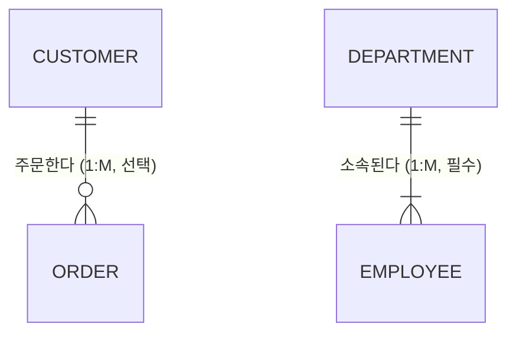

# 1과목. 데이터 모델링의 이해
## 1장. 데이터 모델링의 이해

> [!TIP]
> **개발자를 위한 가이드**
> 코드를 짜기 전에 아키텍처를 고민하듯, DB를 구축하기 전에는 데이터 모델링이 필수입니다. 
> 시스템의 뼈대를 잡는 과정이며, 이곳에서 잘못 꼬이면 훗날 수천 줄의 복잡한 쿼리로 수습해야 하는 대참사가 일어납니다. 이 단원은 데이터베이스 설계의 가장 근본적인 개념을 다룹니다.

---

### 1. 데이터 모델의 이해

#### 1.1 데이터 모델링이란?
복잡한 현실 세계의 업무를 컴퓨터 데이터베이스로 구축하기 위해 **추상화**, **단순화**, **명확화**하여 표현하는 과정입니다.

*   **추상화(Abstraction)**: 현실 세계를 일정한 형식에 맞추어 표현하는 것.
*   **단순화(Simplification)**: 복잡한 현실을 누구나 이해하기 쉽게 제한된 표기법이나 언어로 표현하는 것.
*   **명확화(Clarity)**: 애매모호함을 제거하고 누구나 이해가 가능하도록 정확하게 기술하는 것.

#### 1.2 데이터 모델링의 3가지 관점
데이터 모델링은 시스템을 바라보는 3가지 주요 관점이 있습니다.
1. **데이터 관점 (What, Data)**: 업무가 어떤 데이터와 관련이 있는지, 데이터 간의 관계는 무엇인지 모델링. (구조)
2. **프로세스 관점 (How, Process)**: 업무가 실제 수행하는 일이 무엇인지 모델링. (행위)
3. **데이터와 프로세스의 상관 관점 (Interaction)**: 업무 처리에 따라 데이터가 어떻게 영향을 받고 변하는지 모델링.

#### 1.3 데이터 모델링의 3단계 🏆 (시험 단골 출제)
데이터 모델링은 밑그림을 그리는 것부터 실제 건물을 올리는 것까지 **추상화 수준(포괄성)**에 따라 3단계로 진행됩니다.

| 단계 | 특징 | 설명 |
| :--- | :--- | :--- |
| **1. 개념적 모델링** (Conceptual) | **추상화 수준 최고** 업무 중심적 | 전사적 데이터 아키텍처(EA)를 수립할 때 주로 사용. 핵심 엔터티와 그들 간의 관계를 도출하는 단계. 특정 DBMS에 종속되지 않습니다. |
| **2. 논리적 모델링** (Logical) | **정규화 수행** 재사용성 최고 | 시스템의 논리적 데이터 구조를 설계. 테이블, 식별자, 일반속성 및 릴레이션을 정의합니다. **데이터 모델링의 꽃**이라고 불리며 특정 DBMS에 종속되지 않습니다. |
| **3. 물리적 모델링** (Physical) | **구체화 수준 최고** 성능 고려 | 실제 데이터베이스(Oracle, MySQL 등)에 이식할 수 있도록 물리적인 스키마를 만드는 단계. 테이블스페이스, 인덱스, 파티셔닝 등 하드웨어적 성능을 직접 고려합니다. |

#### 1.4 데이터 독립성 (3단계 스키마 구조)
데이터베이스의 특정 부분이 변경되더라도 다른 부분에 영향을 미치지 않도록 구조화하는 개념입니다.

*   **외부 스키마 (External Schema)**: 사용자나 프로그래머가 접근하는 각각의 뷰(View) 단위.
*   **개념 스키마 (Conceptual Schema)**: 조직 전체의 통합된 데이터 구조. 데이터베이스 설계의 중심.
*   **내부 스키마 (Internal Schema)**: 물리적 저장 장치에 데이터가 실제 저장되는 방법.

> 💡 **논리적 데이터 독립성**: 개념 스키마가 변경되어도 외부 스키마는 영향을 받지 않는다. (예: DB 전체 구조가 바뀌어도 기존 사용자 화면은 그대로 유지)
> 💡 **물리적 데이터 독립성**: 내부 스키마가 변경되어도 개념 스키마는 영향을 받지 않는다. (예: 하드디스크를 교체하거나 파티션을 나눠도 논리적 테이블 구조는 그대로 유지)

---

### 2. 엔터티 (Entity)

#### 2.1 엔터티란?
업무에 필요하고 유용한 정보를 저장하고 관리하기 위한 **집합적인 것(Thing)**. 쉽게 말해 명사이며 엑셀에서의 하나의 **시트(Sheet)** 혹은 DB의 **테이블(Table)**에 해당합니다.

#### 2.2 엔터티의 6가지 특징 (매우 중요)
엔터티로 도출되기 위해서는 다음 6가지 조건을 반드시 만족해야 합니다.
1. **업무에서 필요로 하는 정보**: 시스템을 구축하고자 하는 업무 영역에서 반드시 관리되어야 하는 정보여야 합니다. (예: 병원 업무에서 환자, 의사 등)
2. **유일한 식별자로 식별 가능**: 각각의 데이터(인스턴스)를 유일하게 구분할 수 있는 주식별자(Primary Key)가 있어야 합니다.
3. **2개 이상의 인스턴스의 집합**: 한 명의 고객만을 위해 '고객' 엔터티를 만들지 않습니다. 반드시 인스턴스(데이터 행)가 2개 이상 모여 집합을 이뤄야 합니다.
4. **반드시 속성을 가짐**: 엔터티는 2개 이상의 속성(Attribute)을 가져야 합니다.
5. **업무 프로세스에 의해 이용됨**: 만들어 놓고 안 쓰는 엔터티는 필요 없습니다. 반드시 업무 프로세스에 의해 하나 이상의 로직에서 활용되어야 합니다.
6. **최소 1개 이상의 관계**: 다른 엔터티와 최소 1개 이상의 관계(Relationship)를 가져야 합니다. 고립된 엔터티는 잘못 설계된 것입니다. (단, 공통코드, 통계성 엔터티는 관계 생략 가능)

#### 2.3 발생 시점에 따른 엔터티 분류
| 분류 | 특징 | 예시 |
| :--- | :--- | :--- |
| **기본/키 엔터티** (Fundamental Entity) | 그 업무에 원래 존재하는 정보입니다. 다른 엔터티에 종속되지 않고 독립적으로 생성됩니다. | 사원, 부서, 고객, 상품, 자재 |
| **중심 엔터티** (Main Entity) | 기본 엔터티로부터 파생되어 발생하며 업무에 있어서 중심적인 역할을 합니다. 데이터 양이 많습니다. | 계약, 주문, 접수, 청구, 매출 |
| **행위 엔터티** (Active Entity) | 2개 이상의 부모 엔터티로부터 파생되며 내용이 자주 바뀝니다. 지속적으로 데이터가 쌓입니다. | 주문상세 이력, 사원발령 이력, 접속 로그 |

---

### 3. 속성 (Attribute)

#### 3.1 속성이란?
업무에서 필요로 하는 인스턴스로 관리하고자 하는 의미상 더 이상 분리되지 않는 **최소의 데이터 단위**. 엑셀에서의 **열(Column)**에 해당합니다.

> 💡 **규칙**: 엔터티 내의 속성은 반드시 하나의 값만 가져야 합니다. (원자성) 한 속성에 다중 값이 들어가면 1차 정규화를 통해 분리해야 합니다.

#### 3.2 특성에 따른 속성 분류
*   **기본 속성 (Basic Attribute)**: 업무 분석을 통해 처음부터 정의된 속성. (가장 일반적임) `예: 회원이름, 가입일자`
*   **설계 속성 (Designed Attribute)**: 원래 업무에는 없지만 시스템 설계를 위해 도출해낸 속성. `예: 회원번호(순차 채번), 지점코드`
*   **파생 속성 (Derived Attribute)**: 다른 속성들로부터 계산되거나 영향을 받아 생성되는 속성. (성능 향상을 위해 사용하지만 가급적 적게 정의해야 함) `예: 총주문금액(단가*수량), 이자, 합계`

---

### 4. 관계 (Relationship)

#### 4.1 관계의 정의
엔터티의 인스턴스 사이의 논리적인 연관성. 즉, '고객' 엔터티와 '주문' 엔터티가 어떻게 얽혀있는지를 나타냅니다.

*   **존재에 의한 관계**: 한 엔터티의 존재가 다른 엔터티에 종속됨. (부서와 사원 관계)
*   **행위에 의한 관계**: 특정 이벤트나 행위를 통해 관계가 맺어짐. (고객과 주문 관계)

#### 4.2 관계의 표기법
관계는 **관계명(이름)**, **관계차수(1:1, 1:M, M:N)**, **관계선택성(필수, 선택)** 3가지 개념으로 표기됩니다.

1. **관계차수 (Degree/Cardinality)**: 까마귀 발(Crow's Foot) 표기법을 사용.
   * `1:1` (일대일): 양쪽이 단 하나의 관계만 가짐.
   * `1:M` (일대다): 한쪽은 하나지만 다른 쪽은 여러 개를 가짐. (가장 흔함. 예: 1명의 고객이 여러 주문을 함)
   * `M:N` (다대다): 양쪽 모두 여러 개의 관계를 가짐. (ERD 완성 시 교차 엔터티로 반드시 해소해야 함)
2. **관계선택성 (Optionality)**:
   * **필수적 관계 `|`**: 반드시 관계를 맺어야 함. (주문은 반드시 고객이 있어야 함)
   * **선택적 관계 `O`**: 관계가 맺어질 수도 있고 아닐 수도 있음. 원 동그라미로 표시. (고객은 주문을 할 수도 안 할 수도 있음)

---

### 5. 식별자 (Identifier)

#### 5.1 주식별자의 4대 특징 🏆 (시험 매우 단골)
엔터티 내에서 각 인스턴스를 유일하게 구별할 수 있는 주식별자(Primary Key)는 다음 4가지 조건을 완벽히 만족해야 합니다.
1. **유일성**: 인스턴스들을 서로 고유하게 구별할 수 있어야 합니다. (주민번호, 사번 등)
2. **최소성**: 유일성을 보장하는 데 필요한 최소한의 속성으로 구성되어야 합니다. (사번+이름 조합은 유일하지만 최소성에 위배됨. 사번만으로 충분)
3. **불변성**: 한 번 지정된 주식별자의 값은 변하지 않아야 합니다.
4. **존재성 (NOT NULL)**: 주식별자는 절대로 NULL 값이 들어올 수 없습니다.

#### 5.2 식별자의 분류
*   **대표성 여부**: 
    *   **주식별자(Primary Key)**: 엔터티를 대표하며 다른 엔터티와 참조 관계를 맺음.
    *   **보조식별자(Alternate Key)**: 유일성을 만족하나 대표하지는 못해 참조 관계를 맺지 못함. (예: 회원ID가 PK일 때, 주민번호는 보조키)
*   **생성 여부**:
    *   **내부식별자**: 원래 엔터티 내에 스스로 생성된 식별자.
    *   **외부식별자(Foreign Key)**: 다른 엔터티와의 관계를 통해 받아온 식별자.
*   **단일/복합 여부**:
    *   **단일식별자**: 하나의 속성으로 구성.
    *   **복합식별자**: 두 개 이상의 속성으로 구성.
*   **대체 여부**:
    *   **본질식별자**: 업무에 의해 만들어지는 본래의 식별자.
    *   **인조식별자(대리식별자)**: 복잡한 본질 식별자를 대신하여 임의로 만든 일련번호 등. (예: 주문번호)

#### 5.3 식별자 관계 vs 비식별자 관계
다른 엔터티(부모)로부터 속성을 받아올 때, 자식 엔터티가 그 속성을 어떻게 쓰느냐에 따라 나뉩니다.

| 관계 종류 | 특징 | ERD 표기 | 장단점 |
| :--- | :--- | :--- | :--- |
| **식별자 관계** (Identifying) | 부모로부터 받은 FK를 자식의 **주식별자(PK)로 포함**하여 사용. | 실선 | 부모 데이터가 반드시 존재해야 함 (강한 종속). 조인 횟수를 줄일 수 있으나 PK 구조가 무거워짐. |
| **비식별자 관계** (Non-Identifying) | 부모로부터 받은 FK를 자식의 **일반 속성**으로만 사용. | 점선 | 약한 종속. 부모 없이 자식만 생성될 수도 있음. 모델 구조가 단순해지나 쿼리 시 조인이 자주 발생할 수 있음. |
