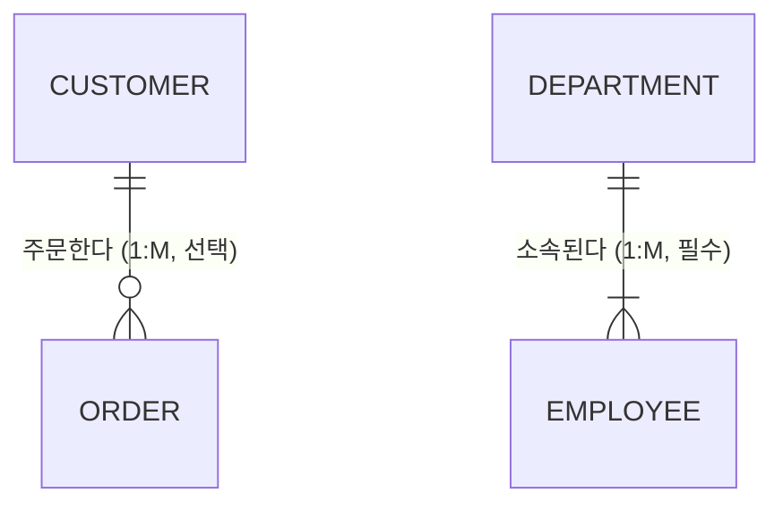

# 1과목. 데이터 모델링의 이해
## 1장. 데이터 모델링의 이해

> [!TIP]
> **들어가며**
> 좋은 프로그램에 설계가 필요하듯, 데이터베이스에도 설계가 필요하다. 그 설계 과정이 바로 데이터 모델링이다.
> 모델링은 시스템의 뼈대를 세우는 일이라, 여기서 구조가 한 번 어긋나면 그 부담은 고스란히 복잡한 쿼리로 되돌아온다. 이 장에서는 데이터베이스 설계의 가장 밑바탕이 되는 개념들을 살펴본다.

---

### 1. 데이터 모델의 이해

#### 1.1 데이터 모델링이란?
데이터 모델링이란 복잡한 현실 세계의 업무를 데이터베이스로 옮기기 위해 그 모습을 **추상화**하고 **단순화**하여 **명확하게** 표현하는 과정이다.

*   **추상화(Abstraction)**: 현실 세계를 일정한 형식에 맞추어 간추려 표현한다.
*   **단순화(Simplification)**: 복잡한 현실을 누구나 이해할 수 있도록 제한된 표기법과 약속된 언어로 간단히 나타낸다.
*   **명확화(Clarity)**: 누구나 같은 뜻으로 읽도록 애매함을 걷어내고 정확하게 기술한다.

#### 1.2 데이터 모델링의 3가지 관점
모델링은 시스템을 세 가지 관점에서 바라본다.

1. **데이터 관점 (What, Data)**: 업무가 어떤 데이터와 관련되는지, 또 데이터끼리 어떻게 이어지는지를 본다. (구조)
2. **프로세스 관점 (How, Process)**: 업무가 실제로 어떤 일을 수행하는지를 본다. (행위)
3. **데이터와 프로세스의 상관 관점 (Interaction)**: 업무가 처리되는 동안 데이터가 어떻게 영향을 받고 달라지는지를 본다.

#### 1.3 데이터 모델링의 3단계
모델링은 밑그림을 그리는 단계에서 실제 건물을 올리는 단계까지, **추상화 수준**에 따라 세 단계를 거치며 점점 구체화된다. 세 단계의 순서와 특징은 시험에 자주 나온다.

| 단계 | 특징 | 설명 |
| :--- | :--- | :--- |
| **1. 개념적 모델링** (Conceptual) | **추상화 수준 최고** 업무 중심 | 전사적 데이터 아키텍처(EA)를 수립할 때 주로 쓴다. 핵심 엔터티와 그 사이의 관계를 도출하는 첫 단계이며, 특정 DBMS에 종속되지 않는다. |
| **2. 논리적 모델링** (Logical) | **정규화 수행** 재사용성 최고 | 시스템의 논리적 데이터 구조를 설계한다. 테이블·식별자·일반 속성과 관계를 정의하며, '데이터 모델링의 꽃'이라 불린다. 이 단계 역시 특정 DBMS에 종속되지 않는다. |
| **3. 물리적 모델링** (Physical) | **구체화 수준 최고** 성능 고려 | 실제 데이터베이스(Oracle, MySQL 등)에 올릴 수 있도록 물리적 스키마를 만든다. 테이블스페이스·인덱스·파티셔닝처럼 성능과 직결되는 요소를 함께 고려한다. |

#### 1.4 데이터 독립성 (3단계 스키마 구조)
데이터베이스의 한 부분을 바꾸어도 다른 부분이 흔들리지 않도록 구조를 세 층으로 나눈 것이 3단계 스키마다.

*   **외부 스키마 (External Schema)**: 사용자나 프로그래머가 마주하는 화면 단위의 뷰(View)다.
*   **개념 스키마 (Conceptual Schema)**: 조직 전체가 공유하는 통합된 데이터 구조로, 설계의 중심이 된다.
*   **내부 스키마 (Internal Schema)**: 데이터가 저장 장치에 실제로 저장되는 방식이다.

> 💡 **논리적 데이터 독립성**: 개념 스키마가 바뀌어도 외부 스키마는 영향을 받지 않는다. 예컨대 데이터베이스 전체 구조가 달라져도 기존 사용자 화면은 그대로 유지된다.
> 💡 **물리적 데이터 독립성**: 내부 스키마가 바뀌어도 개념 스키마는 영향을 받지 않는다. 예컨대 디스크를 교체하거나 파티션을 나누어도 논리적 테이블 구조는 그대로다.

---

### 2. 엔터티 (Entity)

#### 2.1 엔터티란?
엔터티는 업무에 필요한 정보를 저장하고 관리하기 위한 **집합**이다. 대개 명사로 표현되며, 엑셀의 **시트(Sheet)**나 데이터베이스의 **테이블(Table)**에 해당한다고 보면 된다.

#### 2.2 엔터티의 6가지 특징
어떤 대상이 엔터티가 되려면 다음 여섯 가지 조건을 모두 갖추어야 한다.

1. **업무에서 필요로 하는 정보**: 구축하려는 업무 영역에서 반드시 관리되어야 하는 정보여야 한다. (예: 병원 업무의 환자, 의사)
2. **유일한 식별자로 식별 가능**: 각 인스턴스를 유일하게 구분하는 주식별자(Primary Key)가 있어야 한다.
3. **2개 이상의 인스턴스 집합**: 한 명의 고객만을 위해 '고객' 엔터티를 만들지는 않는다. 인스턴스가 둘 이상 모여 집합을 이뤄야 한다.
4. **반드시 속성을 가짐**: 엔터티는 두 개 이상의 속성(Attribute)을 가져야 한다.
5. **업무 프로세스에 의해 이용됨**: 만들어 두고 쓰지 않는 엔터티는 의미가 없다. 하나 이상의 업무 로직에서 실제로 활용되어야 한다.
6. **최소 1개 이상의 관계**: 다른 엔터티와 적어도 하나의 관계(Relationship)를 맺어야 한다. 고립된 엔터티는 잘못된 설계다. (다만 공통코드나 통계성 엔터티는 관계를 생략하기도 한다.)

#### 2.3 발생 시점에 따른 엔터티 분류
| 분류 | 특징 | 예시 |
| :--- | :--- | :--- |
| **기본/키 엔터티** (Fundamental Entity) | 그 업무에 원래부터 존재하는 정보다. 다른 엔터티에 기대지 않고 독립적으로 생성된다. | 사원, 부서, 고객, 상품, 자재 |
| **중심 엔터티** (Main Entity) | 기본 엔터티에서 파생되어 발생하며, 업무의 중심 역할을 한다. 데이터 양이 많다. | 계약, 주문, 접수, 청구, 매출 |
| **행위 엔터티** (Active Entity) | 둘 이상의 부모 엔터티에서 파생되고 내용이 자주 바뀐다. 데이터가 꾸준히 쌓인다. | 주문상세 이력, 사원발령 이력, 접속 로그 |

---

### 3. 속성 (Attribute)

#### 3.1 속성이란?
속성은 더 이상 쪼갤 수 없는 **데이터의 최소 단위**로, 엑셀의 **열(Column)**에 해당한다.

> 💡 **원자성의 원칙**: 하나의 속성은 반드시 하나의 값만 가져야 한다. 한 속성에 여러 값이 들어가면 1차 정규화를 거쳐 나눈다.

#### 3.2 특성에 따른 속성 분류
*   **기본 속성 (Basic Attribute)**: 업무를 분석하면서 처음부터 도출되는, 가장 일반적인 속성이다. `예: 회원이름, 가입일자`
*   **설계 속성 (Designed Attribute)**: 원래 업무에는 없지만 시스템을 설계하면서 새로 만든 속성이다. `예: 회원번호(순차 채번), 지점코드`
*   **파생 속성 (Derived Attribute)**: 다른 속성에서 계산되거나 영향을 받아 생기는 속성이다. 성능에는 도움이 되지만 정합성 유지 비용이 있어 가급적 적게 둔다. `예: 총주문금액(단가×수량), 이자, 합계`

---

### 4. 관계 (Relationship)

#### 4.1 관계의 정의
관계는 엔터티의 인스턴스 사이에 맺어지는 논리적 연관성이다. 예를 들어 '고객'과 '주문'이 서로 어떻게 이어지는지를 나타낸다.

*   **존재에 의한 관계**: 한 엔터티의 존재가 다른 엔터티에 기대는 관계다. (부서와 사원)
*   **행위에 의한 관계**: 특정 사건이나 행위를 통해 맺어지는 관계다. (고객과 주문)

#### 4.2 관계의 표기법
관계는 **관계명(이름)**, **관계차수(1:1, 1:M, M:N)**, **관계선택성(필수, 선택)** 세 가지로 표기한다.

1. **관계차수 (Degree/Cardinality)**: 까마귀 발(Crow's Foot) 표기법으로 나타낸다.
   * `1:1` (일대일): 양쪽이 단 하나씩만 관계를 맺는다.
   * `1:M` (일대다): 한쪽은 하나지만 다른 쪽은 여럿을 가진다. 가장 흔한 형태다. (예: 한 고객이 여러 건을 주문한다.)
   * `M:N` (다대다): 양쪽 모두 여럿을 가진다. ERD를 완성할 때는 교차 엔터티로 반드시 풀어 준다.
2. **관계선택성 (Optionality)**:
   * **필수적 관계 `|`**: 반드시 관계를 맺어야 한다. (주문에는 반드시 고객이 있어야 한다.)
   * **선택적 관계 `O`**: 관계를 맺을 수도, 맺지 않을 수도 있다. 원으로 표시한다. (고객은 주문을 할 수도, 하지 않을 수도 있다.)

---

### 5. 식별자 (Identifier)

#### 5.1 주식별자의 4대 특징
엔터티 안에서 각 인스턴스를 유일하게 구별하는 주식별자(Primary Key)는 다음 네 가지 조건을 빠짐없이 갖추어야 한다. 시험에 특히 자주 나오는 내용이다.

1. **유일성**: 인스턴스를 서로 고유하게 구별할 수 있어야 한다. (주민번호, 사번 등)
2. **최소성**: 유일성을 보장하는 데 필요한 최소한의 속성으로만 구성한다. 예를 들어 '사번+이름'은 유일하긴 하지만 사번만으로 충분하므로 최소성에 어긋난다.
3. **불변성**: 한 번 정해진 주식별자의 값은 바뀌지 않아야 한다.
4. **존재성 (NOT NULL)**: 주식별자에는 NULL 값이 들어올 수 없다.

#### 5.2 식별자의 분류
*   **대표성 여부**
    *   **주식별자(Primary Key)**: 엔터티를 대표하며 다른 엔터티와 참조 관계를 맺는다.
    *   **보조식별자(Alternate Key)**: 유일성은 있으나 대표성이 없어 참조 관계를 맺지 못한다. (예: 회원ID가 PK일 때 주민번호)
*   **생성 여부**
    *   **내부식별자**: 엔터티 안에서 스스로 만들어진 식별자다.
    *   **외부식별자(Foreign Key)**: 다른 엔터티와의 관계를 통해 받아온 식별자다.
*   **속성 수**
    *   **단일식별자**: 하나의 속성으로 이루어진다.
    *   **복합식별자**: 둘 이상의 속성으로 이루어진다.
*   **대체 여부**
    *   **본질식별자**: 업무에서 자연스럽게 만들어진 본래의 식별자다.
    *   **인조식별자(대리식별자)**: 복잡한 본질 식별자를 대신해 임의로 부여한 일련번호 따위다. (예: 주문번호)

#### 5.3 식별자 관계 vs 비식별자 관계
부모 엔터티에게서 속성을 받아올 때, 자식 엔터티가 그 속성을 어떻게 쓰느냐에 따라 두 가지로 나뉜다.

| 관계 종류 | 특징 | ERD 표기 | 장단점 |
| :--- | :--- | :--- | :--- |
| **식별자 관계** (Identifying) | 부모에게서 받은 외래키를 자식의 **주식별자(PK)에 포함**해 쓴다. | 실선 | 부모가 반드시 있어야 하는 강한 종속이다. 조인 횟수를 줄일 수 있지만 PK 구조가 점점 무거워진다. |
| **비식별자 관계** (Non-Identifying) | 부모에게서 받은 외래키를 자식의 **일반 속성**으로만 쓴다. | 점선 | 약한 종속이라 부모 없이 자식만 생길 수도 있다. 구조는 단순해지지만 조회할 때 조인이 잦아질 수 있다. |
