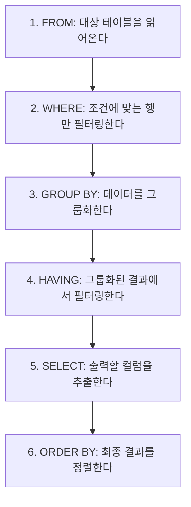

# 2과목. SQL 기본 및 활용
## 1장. SQL 기본

> [!TIP]
> **들어가며**
> 이 장은 개발자가 가장 자주 쓰는 데이터 조작어(DML)의 기본 골격을 다룬다. `SELECT`의 실행 순서, 내장 함수, 그리고 유난히 헷갈리는 `NULL`의 동작과 `GROUP BY`의 원리를 차근차근 짚는다. 실무에서 "왜 데이터가 안 나오지?", "왜 합계가 이상하지?" 하고 막히는 문제의 원인은 대부분 이 장 안에 있다.

---

### 1. 관계형 데이터베이스와 SQL

*   **SQL (Structured Query Language)**: 관계형 데이터베이스(RDBMS)에서 데이터를 다루고 제어하는 표준 언어다.
*   **SQL의 종류**
    *   **DML (데이터 조작어)**: `SELECT`, `INSERT`, `UPDATE`, `DELETE`. 데이터를 다룬다. (비절차적 언어)
    *   **DDL (데이터 정의어)**: `CREATE`, `ALTER`, `DROP`, `TRUNCATE`. 테이블 같은 구조를 다룬다. (실행 즉시 자동 커밋)
    *   **DCL (데이터 제어어)**: `GRANT`, `REVOKE`. 권한을 다룬다.
    *   **TCL (트랜잭션 제어어)**: `COMMIT`, `ROLLBACK`. 논리적 작업 단위를 제어한다.

---

### 2. SELECT 구문의 논리적 실행 순서

우리가 쿼리를 작성하는 순서와 데이터베이스 엔진이 실제로 처리하는 순서는 다르다. 이 순서를 알아야 에러의 원인을 짚을 수 있다.

**[작성 순서]**
1. `SELECT`
2. `FROM`
3. `WHERE`
4. `GROUP BY`
5. `HAVING`
6. `ORDER BY`

**[논리적 실행 순서]**


> **왜 중요한가**: `SELECT`에서 만든 별칭(Alias)을 `WHERE`에서 못 쓰는 이유는 `WHERE`가 `SELECT`보다 먼저 실행되기 때문이다. 반대로 `ORDER BY`는 가장 마지막에 실행되므로 별칭을 쓸 수 있다.

---

### 3. 조건절 (WHERE) 연산자

*   **BETWEEN A AND B**: A와 B 사이의 값을 고른다. 양 끝 A와 B도 포함한다.
*   **IN (list)**: 목록의 값 중 하나라도 일치하면 참이다. `OR`를 묶어 놓은 것과 같다.
*   **LIKE**: 문자열 패턴을 맞춘다.
    *   `%`: 0개 이상의 임의 문자. (`'김%'` → 김으로 시작하는 모든 문자열)
    *   `_`: 정확히 한 개의 임의 문자. (`'김_'` → 김으로 시작하는 두 글자)
*   **IS NULL / IS NOT NULL**: NULL 여부를 가린다. `컬럼 = NULL`은 언제나 `UNKNOWN`을 돌려주므로, NULL을 찾을 때는 반드시 `IS NULL`을 쓴다.

---

### 4. 내장 함수 (Built-in Function)

#### 4.1 단일행 함수
행마다 하나씩 적용되어 한 개의 결과를 돌려주는 함수다. `SELECT`, `WHERE`, `ORDER BY` 어디서든 자유롭게 쓴다.

*   **문자형 함수**
    *   `LOWER(str) / UPPER(str)`: 소문자·대문자로 바꾼다.
    *   `SUBSTR(str, m, n)`: m번째 자리부터 n글자를 잘라 낸다. (예: `SUBSTR('ABCDE', 2, 3)` → 'BCD')
    *   `LENGTH(str)`: 문자열의 길이를 돌려준다.
    *   `REPLACE(str, search, replace)`: 문자를 바꿔치기한다.
*   **숫자형 함수**
    *   `ROUND(num, m)`: 소수점 m자리에서 반올림한다.
    *   `TRUNC(num, m)`: 소수점 m자리에서 버린다.
    *   `MOD(num1, num2)`: num1을 num2로 나눈 나머지를 돌려준다.
*   **변환 함수**
    *   `TO_CHAR()`, `TO_DATE()`, `TO_NUMBER()`처럼 형변환을 명시적으로 수행한다.

#### 4.2 CASE 표현식 (조건문)
IF-THEN-ELSE 논리를 SQL에서 구현한다.
```sql
SELECT
    이름,
    CASE WHEN 급여 >= 5000 THEN '고소득'
         WHEN 급여 >= 3000 THEN '보통'
         ELSE '저소득'
    END AS 소득수준
FROM 사원;
```

---

### 5. NULL의 이해

`NULL`은 '0'도, '빈 공백'도 아니다. **아직 정해지지 않은 미지의 값(Unknown)**이다. 이 성질 때문에 초보자가 가장 자주 걸려 넘어지는 지점이자, 시험에도 꾸준히 나오는 주제다.

#### 5.1 사칙연산과 NULL
**NULL과의 모든 사칙연산(+, −, ×, ÷) 결과는 언제나 NULL이다.**
`100 + NULL`은 100이 아니라 NULL이다. 그래서 연산하기 전에 `NVL`로 감싸 주어야 한다.

#### 5.2 비교 연산과 NULL
`NULL = NULL`은 참일까? 아니다. 미지의 값끼리는 같다고 단정할 수 없으므로 `UNKNOWN`이 된다.

#### 5.3 집계 함수와 NULL
`SUM`, `AVG`, `MAX` 같은 **집계 함수는 NULL이 든 행을 아예 계산에서 뺀다.**

**[예제 테이블: EMP]**
| 사번 | 이름 | 급여(SAL) | 보너스(COMM) |
| :--- | :--- | :--- | :--- |
| 1 | 김 | 100 | 50 |
| 2 | 이 | 200 | NULL |
| 3 | 박 | 300 | NULL |

1.  `SELECT SUM(COMM) FROM EMP;`
    *   결과는 50이다. NULL인 이·박은 계산에서 빠진다.
2.  `SELECT AVG(COMM) FROM EMP;`
    *   결과는 50 ÷ 1 = 50이다. 분모가 전체 3명이 아니라 NULL을 뺀 1명이라는 점에 주의한다.
3.  `SELECT SUM(SAL + COMM) FROM EMP;`
    *   김: 100 + 50 = 150
    *   이: 200 + NULL = NULL
    *   박: 300 + NULL = NULL
    *   결과는 150이다. 합계가 크게 빠져 버린다.

#### 5.4 NULL 관련 함수
*   `NVL(expr1, expr2)`: expr1이 NULL이면 expr2를 돌려준다. (표준 SQL은 `COALESCE`, SQL Server는 `ISNULL`)
*   `NULLIF(expr1, expr2)`: 두 값이 같으면 NULL을, 다르면 expr1을 돌려준다.
*   `COALESCE(e1, e2, e3 …)`: 나열된 값 중 처음으로 NULL이 아닌 값을 돌려준다.

#### 5.5 3치 논리 (Three-Valued Logic, 3VL)
보통의 프로그래밍 언어는 논리값이 참(TRUE)과 거짓(FALSE) **둘뿐**이다. 그런데 SQL은 NULL 때문에 **TRUE, FALSE, UNKNOWN 세 가지**를 가진다. 이를 3치 논리(3VL)라 한다. NULL과 비교한 결과는 참도 거짓도 아닌 **UNKNOWN**이다.

| 식 | 결과 |
| :--- | :--- |
| `1 = 1` | TRUE |
| `1 = 2` | FALSE |
| `NULL = 1` | **UNKNOWN** |
| `NULL = NULL` | **UNKNOWN** (같다고 보지 않는다) |
| `NULL <> 1` | **UNKNOWN** |

> **핵심**: `WHERE`는 결과가 **TRUE인 행만** 통과시키고 UNKNOWN은 걸러 낸다. 그래서 `WHERE COMM = NULL`은 한 건도 나오지 않으며, 반드시 `IS NULL`을 써야 한다.

**[AND / OR 진리표]** (UNKNOWN이 섞일 때)
| A | B | A AND B | A OR B |
| :--- | :--- | :--- | :--- |
| TRUE | UNKNOWN | UNKNOWN | TRUE |
| FALSE | UNKNOWN | FALSE | UNKNOWN |
| UNKNOWN | UNKNOWN | UNKNOWN | UNKNOWN |

> 💡 `NOT IN (서브쿼리)`의 목록에 NULL이 하나라도 끼면 비교가 모두 UNKNOWN이 되어 한 건도 나오지 않는다. 이럴 때는 `NOT EXISTS`를 쓰는 편이 안전하다.

---

### 6. GROUP BY 와 HAVING

특정 컬럼을 기준으로 데이터를 묶어(Grouping) 소계·합계·평균 따위를 구할 때 쓴다.

#### 6.1 문법과 규칙
*   `GROUP BY`에 없는 일반 컬럼은 `SELECT`에 홀로 쓸 수 없다. 반드시 집계함수 안에서만 쓴다.
*   **WHERE와 HAVING의 차이**
    *   `WHERE`: `GROUP BY`로 **묶기 전**, 개별 행을 걸러 낸다. 인덱스를 탈 수 있어 성능에 유리하다.
    *   `HAVING`: `GROUP BY`로 **묶은 뒤**, 집계 결과(SUM, AVG 등)에 조건을 건다.

```sql
SELECT 부서, SUM(급여) AS 총급여
FROM 사원
WHERE 직급 = '과장'       -- 1. 과장인 사람만 먼저 추린다 (행 필터링)
GROUP BY 부서             -- 2. 부서별로 묶는다
HAVING SUM(급여) > 5000;  -- 3. 부서 총급여가 5000을 넘는 그룹만 남긴다 (그룹 필터링)
```
