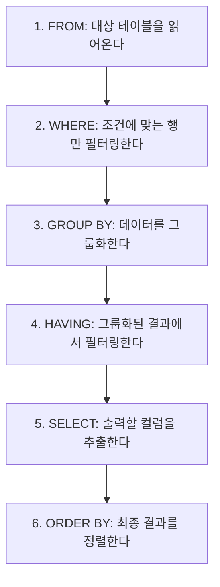

# 2과목. SQL 기본 및 활용
## 1장. SQL 기본

> [!TIP]
> **개발자를 위한 가이드**
> 개발자가 가장 많이 접하는 데이터 조작어(DML)의 기본 골격입니다. 이 장에서는 `SELECT`의 실행 순서, 내장 함수, 그리고 특히 헷갈리기 쉬운 `NULL`의 동작 방식과 `GROUP BY`의 원리를 철저히 파헤칩니다. 실무에서 빈번하게 발생하는 "왜 데이터가 안 나오지?" 혹은 "왜 숫자가 뻥튀기되지?"의 원인이 대부분 이 장에 있습니다.

---

### 1. 관계형 데이터베이스와 SQL

*   **SQL (Structured Query Language)**: 관계형 데이터베이스(RDBMS)에서 데이터를 조작하고 제어하기 위해 사용하는 표준 언어입니다.
*   **SQL의 종류**
    *   **DML (데이터 조작어)**: `SELECT`, `INSERT`, `UPDATE`, `DELETE`. 데이터를 다룹니다. (※ 비절차적 언어)
    *   **DDL (데이터 정의어)**: `CREATE`, `ALTER`, `DROP`, `TRUNCATE`. 테이블 등 구조를 다룹니다. (※ 실행 즉시 Auto Commit)
    *   **DCL (데이터 제어어)**: `GRANT`, `REVOKE`. 권한을 다룹니다.
    *   **TCL (트랜잭션 제어어)**: `COMMIT`, `ROLLBACK`. 논리적 작업 단위를 제어합니다.

---

### 2. SELECT 구문의 논리적 실행 순서 🏆 (매우 중요)

우리가 쿼리를 작성하는 순서와, DB 엔진이 실제로 데이터를 처리하는 순서는 다릅니다. 이 순서를 모르면 에러의 원인을 찾을 수 없습니다.

**[작성 순서]**
1. `SELECT`
2. `FROM`
3. `WHERE`
4. `GROUP BY`
5. `HAVING`
6. `ORDER BY`

**[논리적 실행 순서]**


> 🚨 **실무/시험 꿀팁**: `SELECT` 절에서 만든 별칭(Alias)을 `WHERE` 절에서 쓸 수 없는 이유는? `WHERE`가 `SELECT`보다 먼저 실행되기 때문입니다! 단, `ORDER BY`는 가장 마지막에 실행되므로 `SELECT`에서 만든 별칭을 사용할 수 있습니다.

---

### 3. 조건절 (WHERE) 연산자

*   **BETWEEN A AND B**: A와 B 사이의 값 (A, B 포함)
*   **IN (list)**: 리스트 내의 값 중 하나라도 일치하면 참. `OR` 연산의 묶음과 같습니다.
*   **LIKE**: 문자열 패턴 매칭.
    *   `%`: 0개 이상의 임의의 문자 (`'김%'` -> 김으로 시작하는 모든 단어)
    *   `_`: 정확히 1개의 임의의 문자 (`'김_'` -> 김으로 시작하는 두 글자 단어)
*   **IS NULL / IS NOT NULL**: NULL 여부 판단. `컬럼 = NULL`은 항상 `FALSE(또는 UNKNOWN)`를 반환하므로 반드시 `IS NULL`을 써야 합니다.

---

### 4. 내장 함수 (Built-in Function)

#### 4.1 단일행 함수
각 행(Row)마다 개별적으로 적용되어 1개의 결과를 반환합니다. `SELECT`, `WHERE`, `ORDER BY` 등에 자유롭게 쓰입니다.

*   **문자형 함수**:
    *   `LOWER(str) / UPPER(str)`: 소문자/대문자 변환
    *   `SUBSTR(str, m, n)`: m번째 자리부터 n개의 문자 반환.
        *   *(예: `SUBSTR('ABCDE', 2, 3)` -> 'BCD')*
    *   `LENGTH(str)`: 문자열의 길이 반환.
    *   `REPLACE(str, search, replace)`: 문자 치환.
*   **숫자형 함수**:
    *   `ROUND(num, m)`: 소수점 m자리에서 반올림.
    *   `TRUNC(num, m)`: 소수점 m자리에서 버림.
    *   `MOD(num1, num2)`: num1을 num2로 나눈 나머지.
*   **변환 함수**:
    *   `TO_CHAR()`, `TO_DATE()`, `TO_NUMBER()` 등 형변환을 명시적으로 수행합니다.

#### 4.2 CASE 표현식 (조건문)
IF-THEN-ELSE 논리를 SQL에서 구현합니다.
```sql
SELECT
    이름,
    CASE WHEN 급여 >= 5000 THEN '고소득'
         WHEN 급여 >= 3000 THEN '보통'
         ELSE '저소득'
    END AS 소득수준
FROM 사원;
```

---

### 5. NULL 데이터의 끔찍한 진실 🏆 (무조건 출제됨)

`NULL`은 '0'이나 '빈 공백'이 아닙니다. **'아직 정의되지 않은 미지의 값(Unknown)'**입니다.

#### 5.1 사칙연산과 NULL
**"NULL과의 모든 사칙연산(+,-,*,/) 결과는 무조건 NULL이다."**
`100 + NULL = NULL` 입니다. 이 때문에 연산 전 반드시 `NVL` 처리가 필요합니다.

#### 5.2 비교 연산과 NULL
`NULL = NULL`은 참일까요? 아닙니다. 미지의 값끼리 비교할 수 없으므로 `UNKNOWN`이 됩니다.

#### 5.3 집계 함수와 NULL
`SUM`, `AVG`, `MAX` 등의 **집계 함수는 NULL을 가진 행을 아예 무시(연산에서 배제)합니다.**

**[예제 테이블: EMP]**
| 사번 | 이름 | 급여(SAL) | 보너스(COMM) |
| :--- | :--- | :--- | :--- |
| 1 | 김 | 100 | 50 |
| 2 | 이 | 200 | NULL |
| 3 | 박 | 300 | NULL |

1.  `SELECT SUM(COMM) FROM EMP;`
    *   결과: 50. (NULL인 이, 박은 연산에서 제외)
2.  `SELECT AVG(COMM) FROM EMP;`
    *   결과: 50 / 1 = 50. (분모가 전체 3명이 아니라, NULL을 제외한 1명이 됩니다!)
3.  `SELECT SUM(SAL + COMM) FROM EMP;`
    *   김: 100+50 = 150
    *   이: 200+NULL = NULL
    *   박: 300+NULL = NULL
    *   결과: 150. (전체 합계가 크게 누락됨!)

#### 5.4 NULL 관련 함수
*   `NVL(expr1, expr2)`: expr1이 NULL이면 expr2 반환. (표준 SQL: `COALESCE`, SQL Server: `ISNULL`)
*   `NULLIF(expr1, expr2)`: expr1과 expr2가 같으면 NULL 반환, 다르면 expr1 반환.
*   `COALESCE(e1, e2, e3...)`: 나열된 값 중 첫 번째로 NULL이 아닌 값을 반환.

#### 5.5 3치 논리 (Three-Valued Logic, 3VL) 🏆
일반 프로그래밍 언어의 논리값은 참(TRUE)/거짓(FALSE) **2가지**뿐이지만, SQL은 NULL 때문에 **TRUE / FALSE / UNKNOWN 3가지**를 가집니다. 이것을 3치 논리(3VL)라고 합니다. NULL과 비교한 결과는 참도 거짓도 아닌 **UNKNOWN**입니다.

| 식 | 결과 |
| :--- | :--- |
| `1 = 1` | TRUE |
| `1 = 2` | FALSE |
| `NULL = 1` | **UNKNOWN** |
| `NULL = NULL` | **UNKNOWN** (같다고 보지 않음) |
| `NULL <> 1` | **UNKNOWN** |

> 🚨 `WHERE` 절은 결과가 **TRUE인 행만** 통과시킵니다. UNKNOWN은 통과하지 못합니다. 그래서 `WHERE COMM = NULL`은 한 건도 반환하지 않으며, 반드시 `IS NULL`을 써야 합니다.

**[AND / OR 진리표]** (UNKNOWN이 섞일 때)
| A | B | A AND B | A OR B |
| :--- | :--- | :--- | :--- |
| TRUE | UNKNOWN | UNKNOWN | TRUE |
| FALSE | UNKNOWN | FALSE | UNKNOWN |
| UNKNOWN | UNKNOWN | UNKNOWN | UNKNOWN |

> 💡 `NOT IN (서브쿼리)`의 결과 목록에 NULL이 하나라도 포함되면, 비교가 전부 UNKNOWN이 되어 **한 건도 반환되지 않습니다.** 이런 경우 `NOT EXISTS` 사용을 권장합니다.

---

### 6. GROUP BY 와 HAVING

데이터를 특정한 기준 컬럼으로 묶어서(Grouping) 소계, 합계, 평균 등을 낼 때 사용합니다.

#### 6.1 문법과 규칙
*   `GROUP BY` 절에 명시되지 않은 일반 컬럼은 `SELECT` 절에 단독으로 쓰일 수 없습니다. (반드시 집계함수 안에서 써야 함)
*   **WHERE vs HAVING**:
    *   `WHERE`: `GROUP BY`로 **묶기 전**에 개별 행 단위로 조건을 걸어 필터링합니다. (인덱스 사용 가능하여 성능 유리)
    *   `HAVING`: `GROUP BY`로 **묶은 후** 계산된 집계 결과(SUM, AVG 등)에 조건을 걸어 필터링합니다.

```sql
SELECT 부서, SUM(급여) AS 총급여
FROM 사원
WHERE 직급 = '과장'       -- 1. 과장인 사람만 먼저 추림 (행 필터링)
GROUP BY 부서             -- 2. 부서별로 묶음
HAVING SUM(급여) > 5000;  -- 3. 부서별 총급여가 5000 초과인 그룹만 출력 (그룹 필터링)
```
