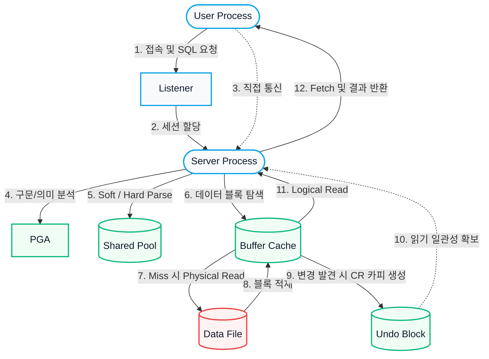
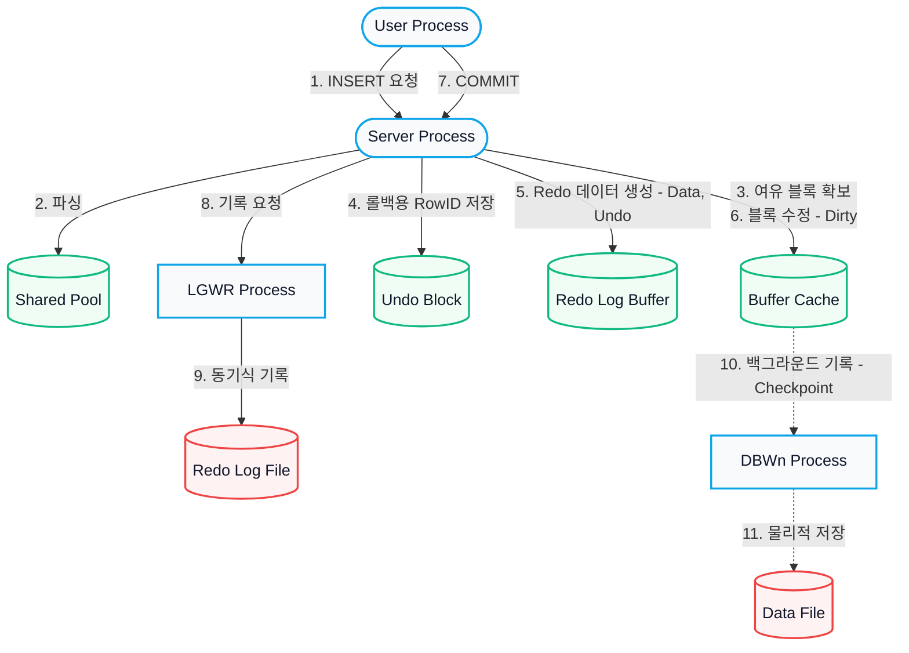
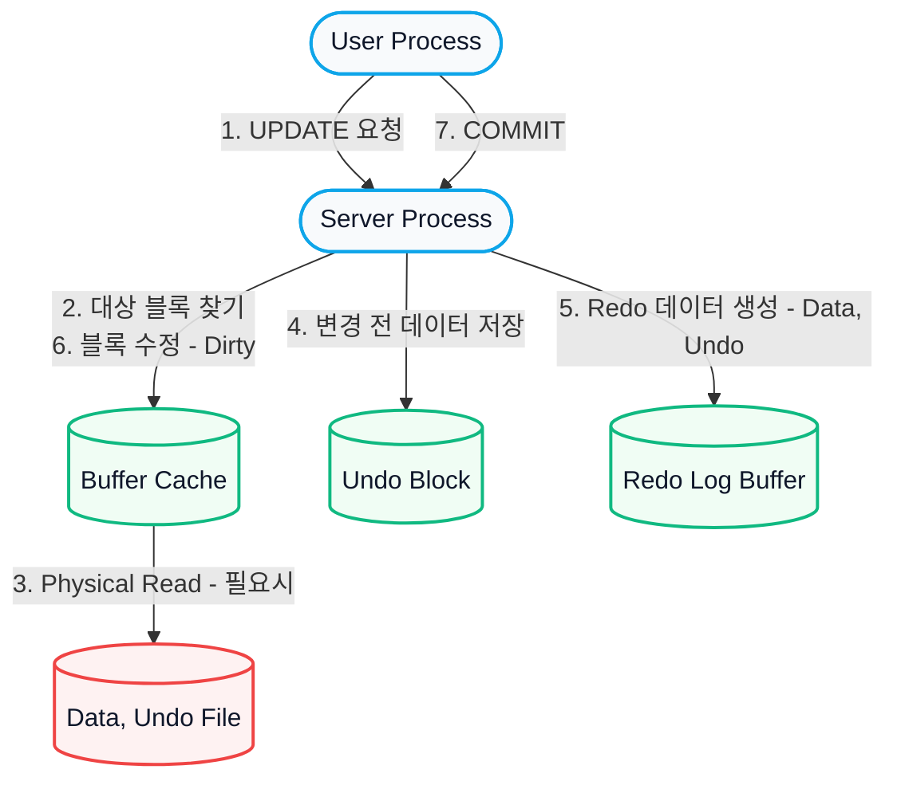
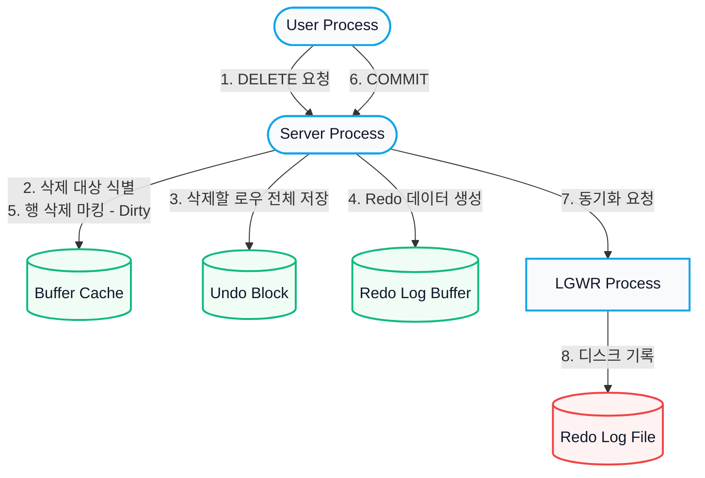

# 오라클 아키텍처 순서도 (SQL 실행 경로)

데이터베이스에서 **SELECT, INSERT, UPDATE, DELETE** 문이 실행될 때 오라클 아키텍처의 각 컴포넌트(User Process, Server Process, SGA, 백그라운드 프로세스 등)를 거치는 전체적인 흐름을 한눈에 파악할 수 있는 순서도입니다.

---

## 1. SELECT 실행 흐름
데이터를 조회할 때는 파싱 후 버퍼 캐시에서 데이터를 찾으며, 미적재 시 디스크에서 읽어옵니다. 단, 조회 시점에 다른 세션이 데이터를 변경 중이거나 변경한 내역이 있다면, **읽기 일관성(Read Consistency)**을 보장하기 위해 **Undo 영역**의 과거 데이터를 참조(CR Read)하여 데이터를 읽습니다.

---

## 2. INSERT 실행 흐름
새로운 데이터를 삽입할 때는 빈 블록을 찾고, 롤백에 대비하여 **Undo 영역**에 삽입된 행의 식별자(RowID)를 저장합니다. 이후 트랜잭션 복구를 위한 Redo 데이터를 생성(Undo+Data)한 뒤 실제 데이터 블록을 수정(Dirty)합니다.

---

## 3. UPDATE 실행 흐름
데이터를 수정할 때는 **읽기 일관성**과 **롤백**을 위해 변경 전 데이터를 Undo에 먼저 저장한 후, 원본 블록을 수정합니다. Redo에는 Undo 변경 내역과 원본 블록 변경 내역이 모두 기록됩니다.

---

## 4. DELETE 실행 흐름
UPDATE와 유사하게 흐름이 진행됩니다. 차이점은 데이터 자체를 지우는 것이 아니라 **로우 단위 삭제 마킹**을 수행하며, 롤백을 위해 지워진 전체 로우 데이터가 Undo에 저장된다는 점입니다.

