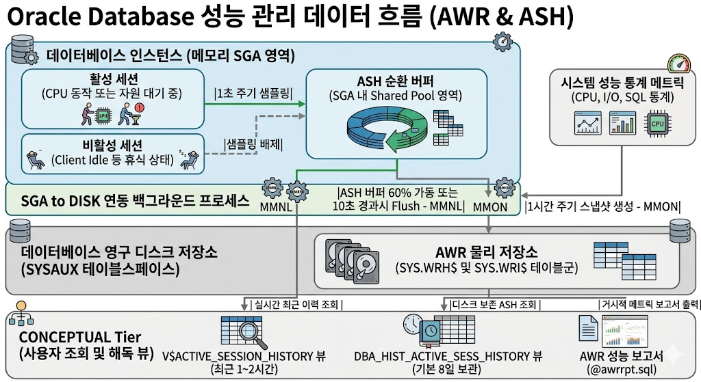
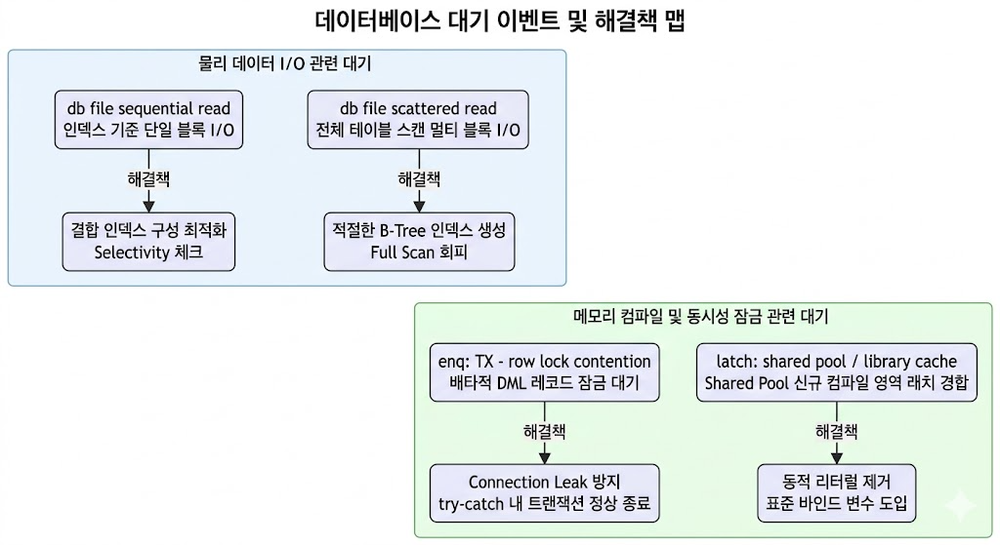

# 제2장. 데이터베이스 성능 이력 분석 (AWR & ASH 아키텍처 및 해석)

본 학습 자료는 오라클 데이터베이스(Oracle Database) 환경을 기준으로 과거에 발생한 다양한 성능 이슈 원인을 규명하기 위한 **AWR(Automatic Workload Repository)** 및 **ASH(Active Session History)** 데이터 수집 메커니즘, 디렉토리 구조, 주요 대기 이벤트 분석 기법을 별도의 외부 자료 없이 단독으로 완전 마스터할 수 있도록 고등학교 정보/컴퓨터 과학 교과서 수준의 명확하고 학술적인 표현으로 기술한 종합 교재입니다.

---

## 1. 사후 성능 진단의 필요성과 데이터 수집 아키텍처 (Architecture)

### 가. 사후 성능 진단의 필요성
데이터베이스 운영 환경에서 빈번하게 발생하는 기술 이슈 유형 중 하나는 **"과거 특정 시점에 시스템 지연(Hang/Bottleneck) 현상이 심각하게 발생했으나, DBA가 접속해 분석하려 할 때는 이미 정상 상태로 복구되어 원인 파악이 힘든 경우"**입니다. 지연 상황이 종료된 이후에는 `V$SESSION`과 같은 메모리 기반 실시간 세션 정보 조회 뷰(Dynamic Performance View)만으로는 과거 이슈 시점의 메모리 적재 상태나 세션 대기 구도를 역추적할 수 없습니다.

따라서 과거의 특정 시간대에 어떤 하드웨어 자원(CPU, 디스크, 메모리) 경합이 있었고 어떤 쿼리가 락(Lock)을 유발해 전체 시스템을 지연시켰는지 사후에 정밀 역추적하기 위해, 데이터베이스 관리 엔진은 성능 이력을 메모리와 디스크 공간에 자동으로 기록하는 수집 모듈을 운용합니다.

### 나. 데이터베이스 내부 수집 아키텍처 및 백그라운드 프로세스

데이터베이스 내부에서 성능 데이터를 손실 없이 기록하기 위해 아래와 같이 유기적인 메모리 버퍼와 백그라운드 프로세스 간 동작 체계가 작동하고 있습니다.



#### 1) ASH (Active Session History) 메모리 수집 원리
* **수집 주기**: **1초 (1 Second)**
* **작동 원리**: 데이터베이스 관리 엔진은 SGA(System Global Area) 메모리 영역에 **ASH 순환 버퍼(ASH Circular Buffer)**를 할당합니다. 1초에 한 번씩 시스템의 전체 세션을 조사하여, CPU를 점유하여 연산 중이거나 특정 자원 획득을 위해 대기 상태(`WAITING`)에 빠져 있는 **활성 세션(Active Session)**의 스냅샷 데이터만 추출하여 버퍼에 기입합니다.
* **오버헤드 최소화 기법**: 사용자 요청에 응답하고 다음 SQL을 대기 중인 유휴 세션(`Client Idle`, `SQL*Net message from client`)은 샘플링 대상에서 철저히 제외합니다. 이를 통해 시스템 성능 부하를 $1\%$ 미만으로 억제하며 초고속 샘플링을 구현합니다.
* **보관 한계**: 물리적으로 할당된 버퍼 크기가 가득 차면 가장 오래된 기록을 덮어쓰는 순환 구조(Circular Buffer)이므로, 일반적으로 최신 1~2시간 내의 정보만 메모리에 유지됩니다.

#### 2) AWR (Automatic Workload Repository) 디스크 저장소 영구화 원리
* **수집 주기**: **기본 1시간 (1 Hour)**
* **작동 원리**: 데이터베이스 엔진은 백그라운드 프로세스를 사용하여 주기적으로 성능 수치를 디스크의 `SYSAUX` 테이블스페이스 내 `SYS` 스키마 아래의 영구 테이블군(`WRH$` - Workload Repository History, `WRI$` - Workload Repository Information)에 영구 저장합니다.
* **백그라운드 프로세스 역할 분담**:
  * **MMON (Manageability Monitor)**: 1시간에 한 번씩 규칙적인 간격으로 데이터베이스의 전반적인 누적 통계(CPU 소모량, 블록 읽기/쓰기 수, SQL 누적 수행량 등)의 스냅샷(Snapshot)을 떠서 디스크에 영구 기입합니다.
  * **MMNL (Active Session History Light)**: 메모리에 위치한 ASH 순환 버퍼가 60% 이상 차오르거나 10초 주기가 경과했을 때, 버퍼 내부의 세션 샘플 데이터 중 **10%만 무작위 압축 샘플링(10초당 1건 수준)**하여 디스크 테이블(`SYS.WRH$_ACTIVE_SESSION_HISTORY`)로 조용히 Flush하는 임무를 담당합니다.
* **디스크 데이터 보존 기한**: **기본 8일 (8 Days)**. 설정에 따라 보존 기한 및 스냅샷 간격을 유연하게 늘릴 수 있습니다.

---

## 2. ASH (Active Session History) 미시적 분석 및 트러블슈팅

ASH 분석은 **"과거 특정 시각(예: 14시 32분)에 시스템이 순간적으로 멈추었던 정확한 원인"**을 미시적으로 샅샅이 헤집어 볼 때 사용하는 가장 강력한 무기입니다.

### 가. ASH 핵심 분석 속성 (Column) 정의 및 해독법

과거 실시간 세션 활동 상태를 담은 `V$ACTIVE_SESSION_HISTORY` 뷰의 핵심 컬럼과 그 의미는 다음과 같습니다.

| 컬럼명 | 타입 | 물리적 상세 정의 및 진단적 가치 |
| :--- | :--- | :--- |
| **`SAMPLE_TIME`** | Timestamp | 성능 정보가 샘플링된 정확한 타임스탬프 시각 (초 단위). 이 시각을 기준으로 장애 발생 구간의 세션 분포도를 1초 단위로 그릴 수 있습니다. |
| **`SESSION_ID`** | Number | 작업을 시도하거나 대기하고 있는 세션의 고유 식별 번호 (SID, Session Identifier). |
| **`SESSION_STATE`** | Varchar2 | 세션의 현재 구동 상태를 나타냅니다.<br>- `ON CPU`: 세션이 CPU 연산 장치를 직접 점유하여 실행계획이나 산술 연산을 처리 중인 상태.<br>- `WAITING`: 특정 자원(디스크 블록, Lock 등)이 부족하여 운영체제 커널의 시그널 대기 큐에서 대기하고 있는 상태. |
| **`EVENT`** | Varchar2 | `SESSION_STATE`가 `WAITING`일 때 대기를 유발한 구체적인 원인 이벤트명. (예: `db file sequential read`, `enq: TX - row lock contention` 등) |
| **`P1, P2, P3`** | Number | 대기 이벤트별로 다르게 채워지는 세부 하드웨어 물리 주소 값.<br>- **I/O 이벤트 시**: P1 = 읽고자 하는 데이터 파일 번호 (`file#`), P2 = 물리 데이터 블록 주소 (`block#`), P3 = 읽어들인 블록 크기 (`blocks`).<br>- **Lock 이벤트 시**: P1 = 락 종류 및 모드 주소, P2 = 관련 테이블 주소. |
| **`SQL_ID`** | Varchar2 | 세션이 샘플링 시각에 가동하고 있던 SQL 문장의 고유 해시 주소. 이를 통해 병목을 유발한 불량 쿼리 소스 코드를 단번에 색출합니다. |
| **`BLOCKING_SESSION`** | Number | 현재 `WAITING` 상태에 있는 세션을 가로막고 작업을 지연시키고 있는 **선행 세션 번호(Blocker SID)**. 이 칼럼이 비어있지 않다면, 락 경합(Lock Contention)이 발생했음을 즉시 확정할 수 있습니다. |

### 나. 락 대기 트리(Lock Tree) 추적을 위한 실무 recursive SQL 기법

여러 세션이 연속적으로 차단되어 꼬리에 꼬리를 무는 대기 줄이 늘어섰을 때, 아래와 같이 **계층형 쿼리(Hierarchical Query - `CONNECT BY`)**를 사용해 최종적으로 리소스를 독점하고 시스템 전체를 대기 상태로 만든 **최상단 Blocker 세션**을 정밀 추적할 수 있습니다.

```sql
SELECT LEVEL AS "LOCK_DEPTH"
     , LPAD(' ', (LEVEL-1)*4) || ASH.SESSION_ID AS "SESSION_ID"
     , ASH.BLOCKING_SESSION AS "BLOCKER_SID"
     , ASH.SESSION_STATE
     , ASH.EVENT AS "WAIT_EVENT"
     , ASH.SQL_ID
     , SQL.SQL_TEXT
FROM V$ACTIVE_SESSION_HISTORY ASH
LEFT JOIN V$SQL SQL
  ON ASH.SQL_ID = SQL.SQL_ID
WHERE ASH.SAMPLE_TIME = TO_TIMESTAMP('2026-05-18 14:32:12', 'YYYY-MM-DD HH24:MI:SS')
START WITH ASH.BLOCKING_SESSION IS NOT NULL
CONNECT BY PRIOR ASH.SESSION_ID = ASH.BLOCKING_SESSION
       AND PRIOR ASH.SAMPLE_TIME = ASH.SAMPLE_TIME;
```
* **동작 원리**: 샘플링 타임이 같은 시점 내에서 `BLOCKING_SESSION` 구조를 통해 트리 형태로 노드 간의 락 종속성을 추적합니다. 트리 루트에 위치한 `BLOCKING_SESSION`이 존재하지 않으면서 남들을 대기시키는 최상단 세션을 즉시 식별하여 `KILL` 처리하는 등의 의사결정을 내릴 수 있습니다.

---

## 3. AWR (Automatic Workload Repository) 거시적 지표 및 임계값 수학적 진단

AWR 분석은 **"오늘 전체 서비스의 성능 추이가 안정적이었는가?"** 또는 **"어제 배치 작업을 진행했던 3시간 동안 전체 리소스 부하가 어떻게 움직였는가?"**와 같은 거시적인 시스템 부하를 과학적인 통계 수학 공식과 표준 임계값으로 종합 진단할 때 활용됩니다.

### 가. Load Profile : 시스템의 처리 밀도 수학적 진단 공식

| 핵심 지표 | 수학적 계산 공식 및 의미 | 학술적 성능 진단 및 임계값 기준 |
| :--- | :--- | :--- |
| **DB Time** | $$\text{DB Time} = \text{CPU Time} + \text{Wait Time (Non-Idle)}$$<br>측정 대상 기간 동안 활성 세션들이 일하고 대기한 전체 누적 시간의 절대량 합산. | 물리 시간 동안 활성 프로세스들이 소모한 총 시간이므로, 인스턴스의 실제 에너지 소비 총량과 대응됩니다. |
| **AAS**<br>(Average Active Sessions) | $$\text{AAS} = \frac{\text{DB Time (seconds)}}{\text{Snapshot Duration (seconds)}}$$<br>해당 측정 시간(Snapshot Interval) 동안 **동시에 실행 중이거나 대기 중이던 활성 세션의 평균 개수**. | **[임계값 판단 기준]**<br>- $\text{AAS} < \text{물리 CPU Core 수}$: 시스템 자원에 여유가 있으며 병목이 발생하지 않는 매우 안전한 상태.<br>- $\text{AAS} \approx \text{물리 CPU Core 수}$: 전체 하드웨어가 100% 한계 용량으로 풀 가동 중인 초임계 상태.<br>- $\text{AAS} > \text{물리 CPU Core 수}$: 하드웨어 용량을 넘어선 연산 요청이 몰려 CPU 대기 행렬(Run Queue)이 늘어나 지수적 지연이 나타나는 **위험 상태**. |
| **Parses /s**<br>(Total & Hard) | $$\text{Hard Parses/s} = \frac{\text{Hard Parses Count}}{\text{Elapsed Time (seconds)}}$$<br>1초 동안 시스템 전체에서 새로 생성(컴파일)되어 등록된 SQL의 평균 개수. | **[임계값 판단 기준]**<br>- 일반적인 건전한 시스템: $\text{Hard Parses/s} < 5.0$<br>- **위험 기준**: $\text{Hard Parses/s} \ge 100.0$<br>초당 Hard Parse 건수가 100건을 상회하는 경우 Shared Pool 래치 획득을 위해 CPU 코어가 풀 가동되어 데이터베이스 전체가 행(Hang)에 가깝게 느려집니다. |

### 나. Instance Efficiency Percentages : 메모리 캐시 최적화 지표

데이터베이스 내의 캐시 구조와 최적화 로직이 낭비 없이 완벽하게 돌고 있는지 검증하는 백분율 지표군입니다.

1. **Buffer Hit Ratio (버퍼 캐시 적중률)**:
   $$\text{Buffer Hit \%} = \left( 1 - \frac{\text{Physical Reads (물리 읽기 블록 수)}}{\text{Logical Reads (논리 읽기 블록 수)}} \right) \times 100$$
   * **진단 기준**: **95% 이상**이 정상 범주입니다. 이 수치가 지나치게 낮다면 대다수 쿼리가 고속의 메모리(SGA Buffer Cache)를 거치지 않고 물리 디스크를 직접 긁고 있는 상태(인덱스 부재 등)로 판단합니다.
2. **Soft Parse Ratio (소프트 파싱 성공률)**:
   $$\text{Soft Parse \%} = \left( 1 - \frac{\text{Hard Parses (하드 파싱 횟수)}}{\text{Total Parses (전체 파싱 횟수)}} \right) \times 100$$
   * **진단 기준**: **99.9% 이상** 유지가 절대적입니다. **99% 미만**으로 하락하는 경우, 소스 코드 내에서 표준 바인드 변수(Bind Variable) 사용 원칙을 어기고 상수 리터럴을 쿼리에 결합해 보내는 개발자가 있음을 의미합니다.

---

## 4. 대기 이벤트 백과사전 (Wait Events Encyclopedia)

데이터베이스가 느려질 때, AWR 리포트의 `Top Foreground Wait Events` 섹션에 나타나는 4대 주요 이벤트의 컴퓨터 구조학적 메커니즘과 구체적 해결 방안입니다.



### 가. db file sequential read (단일 블록 물리 읽기 대기)
* **발생 원인**: B-Tree 인덱스를 거쳐 데이터를 하나씩 가져올 때, 메모리 버퍼 캐시에 관련 테이블 레코드가 존재하지 않아 디스크로부터 1개의 블록(Single Block)을 순차적으로 읽어 올 때 대기가 발생합니다.
* **성능 진단**: 이 이벤트의 발생 횟수가 지나치게 높다면, 넓은 범위의 데이터를 조회하는 SQL이 인덱스 레인지 스캔을 수행하여 수십만 번의 무작위 디스크 접근(Random I/O)을 발생시키고 있는 비효율적인 상황일 수 있습니다.
* **DBA의 튜닝 조치**:
  1. 조건절 컬럼의 선택도(Selectivity)를 엄격히 계산하여, 가져오는 범위가 넓을 경우 인덱스 탐색 대신 다중 블록을 읽는 `Full Table Scan`이 작동하도록 옵티마이저 힌트(`/*+ FULL(table) */`)를 기입합니다.
  2. 자주 조회되는 컬럼들을 묶어 결합 인덱스(Composite Index)를 구성함으로써 인덱스 잎 노드만 읽고 테이블 블록 조회를 최소화하는 `Index Fast Full Scan` 또는 `Index Only Access` 구조로 최적화합니다.

### 나. db file scattered read (다중 블록 물리 읽기 대기)
* **발생 원인**: 인덱스를 사용하지 못해 전체 테이블을 처음부터 끝까지 다 긁어내는 `Full Table Scan`이나 `Index Fast Full Scan`이 발동될 때, 연속된 여러 개의 디스크 물리 블록을 한꺼번에 메모리 버퍼로 읽어 들이며 대기가 발생합니다. (Scattered: 디스크 상에 뭉쳐 있는 데이터 블록들이 SGA 메모리 버퍼 캐시 내의 여러 불연속적인 슬롯 공간으로 쪼개져 흩어져 적재된다는 물리 구조학적 명칭에서 유래)
* **성능 진단**: 인덱스가 아예 없거나, 조건절 컬럼에 변형(예: `TO_CHAR(reg_date)`)을 가해 기존 인덱스를 사용하지 못하고 풀 스캔으로 빠지고 있을 확률이 다분합니다.
* **DBA의 튜닝 조치**:
  1. 병목 SQL 쿼리의 WHERE 조건절을 확보하여, 검색 컬럼에 B-Tree 인덱스를 새롭게 구축합니다.
  2. 쿼리 조건절 좌변 컬럼에 가해진 변형(묵시적 형변환 등)이나 Leading Wildcard 기법(`LIKE '%abc'`)을 걷어내어 정상적으로 인덱스 레인지 스캔(Index Range Scan)이 적용될 수 있도록 수정합니다.

### 다. enq: TX - row lock contention (행 레벨 트랜잭션 락 대기)
* **발생 원인**: 트랜잭션 내에서 한 세션이 `UPDATE` 또는 `DELETE`로 특정 레코드를 수정하는 즉시, 해당 레코드에 배타적 락(Exclusive Lock)이 걸립니다. 이 상태에서 다른 세션이 동일한 행을 수정하려고 할 때, 앞서 작업을 시작한 선행 세션이 트랜잭션을 끝내고 락을 놓아줄 때까지 무한히 대기 큐에서 대기하는 물리 현상입니다.
* **성능 진단**: 대기 현상이 발생했을 때 선행 블로커 세션의 상태가 무연산 유휴 상태(`Client Idle` / `INACTIVE`)로 남아 있다면, 이는 전형적인 **Connection Leak(커넥션 누수) 이슈**입니다.
* **DBA의 튜닝 조치**:
  1. 응용 프로그램 레벨의 소스 코드를 조사하여 `try-catch` 예외 처리 블록 내에 예외가 발생했더라도 트랜잭션이 종결될 수 있도록 `connection.rollback()` 및 `connection.commit()` 처리를 확실하게 마무리 짓습니다.
  2. 웹 서버가 커넥션 풀을 관리할 때 장시간 트랜잭션 커밋 없이 반환되지 않는 커넥션을 자동으로 감지하고 회수하는 커넥션 풀 타이머 설정(예: `maxLifetime`, `transactionTimeout`)을 추가 보완합니다.

### 라. latch: shared pool / library cache (메모리 구조체 래치 경합 대기)
* **발생 원인**: Shared Pool 메모리 영역에 새로운 SQL 문장을 분석하여 실행 계획(Execution Plan) 트리를 적재하는 하드 파싱 과정에서, SGA 내부 메모리 힙(Heap) 영역에 새로운 노드를 할당하고 캐시 구조체를 잠그는 래치(상호 배제 락)를 획득하기 위해 대기하는 현상입니다.
* **성능 진단**: `Hard Parses/s` 지표가 치솟는 현상과 동반되며, 시스템 CPU 사용률이 디스크 I/O 없이 100% 임계를 유지합니다.
* **DBA의 튜닝 조치**:
  1. 응용 프로그램 상에서 SQL 문자열에 직접 사용자의 입력을 조합해 보내는 리터럴 가변식 동적 쿼리를 모두 제거하고, 표준 바인드 파라미터(`?` 또는 `#` 등) 기반의 변수 입력 방식을 도입하여 이미 캐싱된 실행 계획을 99.9% 완벽 재사용하도록 유도합니다.
  2. 임시 땜질 패치 방편으로 데이터베이스 인스턴스 파라미터의 `CURSOR_SHARING` 설정을 기본값인 `EXACT`에서 `FORCE`로 일시 전환하여 데이터베이스 컴파일러가 강제로 상수 리터럴을 내부 시스템 변수로 치환하여 분석 계획을 재활용하게 강제 처리합니다.

---

## 5. 실전 이슈 분석 시나리오 및 해결 코드 (Case Studies)

### 📌 [이슈 1] 예외 처리 설계 결함으로 인한 락 경합 이슈 (Connection Leak)

* **이슈 현상**: 회원 데이터 수정 기능을 수행하는 프로세스들의 연산 지연이 발생하며 결국 전체 서비스 정체로 이어짐.
* **현장 데이터 분석 단계**:
  1. AWR 리포트 확인: `Top Foreground Wait Events` 분석 시 `enq: TX - row lock contention` 대기 이벤트 점유율이 전체 DB Time의 **78%**에 이름.
  2. ASH 이력 정밀 추적: 14시 32분 이력 조회 결과 다수의 세션이 `WAITING` 상태이며 `BLOCKING_SESSION`으로 `SID 412`를 지목하고 있음.
  3. Blocker 정보 규명: `SID 412` 세션의 상세 이력을 클릭해 조사해보니, 상태는 `ON CPU (INACTIVE)` 상태로 실제 아무 연산도 안 하며 연결만 쥔 채 잠금(Exclusive Row Lock)을 지속하고 있는 커넥션 누수(Connection Leak) 현상이 확정됨.

#### [AS-IS 결함 소스 코드 예제 (Java JDBC)]
```java
public void updateMemberPoints(int memberNo, int points) throws SQLException {
    Connection conn = dataSource.getConnection();
    Statement stmt = conn.createStatement();
    try {
        conn.setAutoCommit(false); // 수동 트랜잭션 제어 시작
        // 특정 회원 행에 대해 UPDATE 실행 및 배타적 Lock 획득
        stmt.executeUpdate("UPDATE members SET points = " + points + " WHERE member_no = " + memberNo);
        
        // 🚨 비즈니스 로직 연산 중 묵시적 오류가 발생한다면?
        int bonus = points / 0; // ArithmeticException 예외 발생!
        
        conn.commit(); // 실행되지 못하고 바이패스됨
    } catch (Exception e) {
        // 🚨 치명적인 실수: 예외가 터졌으나 rollback() 처리가 없음!
        System.err.println("오류 발생: " + e.getMessage());
    } finally {
        stmt.close();
        conn.close(); // 🚨 트랜잭션이 커밋/롤백되지 않은 채 커넥션이 WAS 풀에 반환되어 락 방치!
    }
}
```

#### [TO-BE 정상 개선 소스 코드 예제]
```java
public void updateMemberPoints(int memberNo, int points) throws SQLException {
    Connection conn = null;
    PreparedStatement pstmt = null;
    try {
        conn = dataSource.getConnection();
        conn.setAutoCommit(false); // 수동 트랜잭션 제어 보장
        
        // 바인드 변수를 사용하여 하드 파싱 예방
        String sql = "UPDATE members SET points = ? WHERE member_no = ?";
        pstmt = conn.prepareStatement(sql);
        pstmt.setInt(1, points);
        pstmt.setInt(2, memberNo);
        pstmt.executeUpdate();
        
        // 비즈니스 로직 수행
        int bonus = points / 10; 
        
        conn.commit(); // 트랜잭션 안전하게 커밋 완료
    } catch (Exception e) {
        if (conn != null) {
            conn.rollback(); // ✔ 예외 발생 시 즉시 변경 사항 및 Row Lock 100% 해제(Rollback) 보장!
        }
        throw new SQLException("업데이트 중 비즈니스 롤백 처리: " + e.getMessage());
    } finally {
        if (pstmt != null) pstmt.close();
        if (conn != null) conn.close(); // ✔ 커넥션 반환 전 안전하게 트랜잭션이 해제되어 WAS 풀로 깔끔하게 원복됨!
    }
}
```

---

### 📌 [이슈 2] 상수 대입형 쿼리 남발에 따른 CPU 고갈 이슈 (Hard Parse)

* **이슈 현상**: 특정 조회 서비스 유입 증가 시, 데이터베이스 서버의 CPU 사용률이 즉각 100%에 도달해 전체 웹 화면이 흰색 먹통 상태로 변함.
* **현장 데이터 분석 단계**:
  1. AWR 리포트 확인: `Load Profile` 분석 시 `Hard Parses /s` 수치가 평시 1건 수준에서 **385건**으로 치솟음. `Instance Efficiency` 영역의 `Soft Parse %` 지표가 **32.4%**로 폭락함.
  2. Wait Events 순위 확인: `CPU time` 대기 점유율이 **85%**로 최상위를 유지하고 있으며, `latch: shared pool` 경합이 약 **10%**로 검출됨.
  3. 원인 식별: 조회 쿼리들이 Shared Pool의 실행계획 메모리를 점유하기 위해 계속 컴파일 연산을 수행하느라 CPU 리소스를 100% 갉아먹는 상황임.

#### [AS-IS 결함 소스 코드 예제 (MyBatis Mapper)]
```xml
<!-- 🚨 리터럴 결합 문법($)을 사용하여 매 요청마다 다른 쿼리로 빌드되어 하드 파싱 유발 -->
<select id="findMemberDetails" resultType="Member">
    SELECT name, phone, email 
    FROM members 
    WHERE member_no = ${memberNo}
</select>
```
* **결과**: `WHERE member_no = 1001`, `WHERE member_no = 1002` 등 입력되는 숫자마다 전부 개별 SQL 쿼리로 컴파일되어 Shared Pool에 낱개 등록되므로 메모리가 조기에 고갈되고 래치 충돌이 유발됩니다.

#### [TO-BE 정상 개선 소스 코드 예제 (MyBatis Mapper)]
```xml
<!-- ✔ 표준 바인드 파라미터 문법(#)을 사용하여 컴파일된 단 하나의 실행계획만 메모리에 적재 및 재사용 -->
<select id="findMemberDetails" resultType="Member">
    SELECT name, phone, email 
    FROM members 
    WHERE member_no = #{memberNo}
</select>
```
* **결과**: `WHERE member_no = ?` 형태로 분석이 단 한 번만 진행된 후 실행계획이 Shared Pool 라이브러리 캐시에 고정되므로, 매번 쿼리가 들어올 때 가볍게 캐시에서 찾아 실행(Soft Parse)하므로 시스템 CPU 로드가 0%대에 수렴하게 됩니다.

---

## 6. 학습 성취도 평가 문제 📝

1. **평균 활성 세션 수(AAS)가 8이고 서버에 장착된 물리 CPU 코어(Core) 수가 4일 때, 이 시스템의 성능 상태를 컴퓨터 구조학적 관점에서 설명하고 바람직한 조치 방향을 논하시오.**
   * *모범 답안*: 시스템은 현재 하드웨어의 연산 한계 용량을 초과한 심각한 임계 지연 및 대기 행렬 정체(Queue Bottleneck) 상태에 처해 있습니다. CPU 스케줄러 큐 대기로 인한 Context Switching 오버헤드가 누적되고 있습니다. 무조건적인 하드웨어 스케일 아웃(서버 증설)을 추진하기보다는, AWR 및 ASH 데이터를 먼저 추출하여 'Hard Parses/s'가 급증하는 바인드 변수 누락 쿼리가 있는지, 혹은 'db file scattered read'를 유발하는 인덱스 누락 쿼리가 있는지 발굴하여 SQL 튜닝 및 애플리케이션의 파라미터 기입부 교정 조치를 선행하는 것이 바람직합니다.

2. **AWR 리포트 분석 중 `db file sequential read` 이벤트가 상위 1위에 있을 때, 튜닝을 목적으로 신규 인덱스를 무조건 추가 개설하는 해결책이 정당한지 논하시오.**
   * *모범 답안*: 정당하지 않습니다. `db file sequential read` 이벤트는 단일 블록 물리 읽기를 수행할 때 발생하며, 이미 존재하는 인덱스를 사용하여 좁은 범위를 여러 번 조회하는 과정에서도 잦은 무작위 디스크 접근(Random I/O)이 누적될 때 상위에 노출됩니다. 이때 인덱스를 추가 생성하면 오히려 디스크 헤더의 이동 거리가 늘어나 디스크 물리 읽기 대기가 지연될 수 있습니다. 따라서 무조건적인 인덱스 신규 생성보다는, 기존 조건절 컬럼의 변별력을 계산해 결합 인덱스의 순서를 최적화하거나, 읽어야 할 데이터 세트의 범위가 넓은 경우 옵티마이저 힌트 등을 활용하여 차라리 다중 블록을 빠르게 퍼 올리는 전체 테이블 스캔(Full Table Scan)으로 유도하는 튜닝이 올바른 방향입니다.
