# Spharos Design System

> SHINSEGAE I&C **Spharos** 브랜드의 시각 컨셉을 웹(및 문서)에 일관되게 적용하기 위한 디자인 가이드.
> PPT 템플릿(`Spharos_PPT_Template v3.0`)에서 추출·정규화한 토큰을 기준으로 한다.

---

## 1. 브랜드 컨셉 & 규격

- **키워드**: 신뢰(Trust) · 명료(Clarity) · 선명한 강조(Sharp Accent)
- **무드**: 라이트 배경 + 딥네이비 구조 + 옐로우 포인트의 미니멀리즘
- **시그니처**: 좌하단 **로고 + 카피라이트** 푸터
- **기본 규격**: 16:9 와이드스크린 (Widescreen 13.33인치 × 7.5인치 / 12,192,000 × 6,858,000 EMUs)
  - 웹/화면 대응 시 기준 해상도: **960px × 540px** 또는 **1920px × 1080px**로 비례 대응.
- **운용 원칙(60·30·10)**: 화이트/그레이/틴트배경 60% · 네이비 30% · 옐로우 10%
  - 옐로우는 "강조/액션/미래"에만 적용하며, 넓은 면적의 배경으로 사용하지 않는다.

---

## 2. 컬러 팔레트

### 2.1 Core

| 역할 | 이름 | HEX | 용도 |
|---|---|---|---|
| Primary | **Navy** | `#002A5B` | 구조색 — 헤더 밴드, 배지, 강조 텍스트, 버튼, 메인 번호(32pt) |
| Heading | **Ink** | `#121D2A` | 대제목·본문 강조(near-black navy) |
| Accent | **Yellow** | `#F9BB00` | 포인트 — 액센트 바, 태그, 하이라이트, 스퀘어 불릿 |

### 2.2 Neutral & Tints

| 이름 | HEX | 용도 |
|---|---|---|
| Gray BG | `#EFEFEF` | 중립 밴드/박스 배경(핵심 메시지 등) |
| Card BG | `#F7F8FA` | 카드 기본 배경 |
| Light Blue BG | `#E6EDF7` | 틴트 배경 — 테이블 헤더 배경, 강조 카드 배경 |
| Soft Blue Border | `#BBD0F2` | 연한 블루 보더 — 하이라이트 카드 테두리, 강조 라인 |
| Line (Standard) | `#CBD5E1` | 표준 구분선·보더 (기존 `#E3E6EB`과 함께 사용) |
| Body | `#424A57` | 본문 텍스트 |
| Slate | `#64748B` | 보조 라벨 · 중립 태그 · KPI 서브라벨 |
| Muted | `#8A93A3` | 캡션 · 비활성 · 영문 서브타이틀 |
| White | `#FFFFFF` | 페이지 기본 배경 및 Navy/Slate 위 텍스트 |

### 2.3 Accent 보조 (데이터 시각화용 블루)

테마에 내장된 블루 계열. 차트/그래프 등 정보 구분이 필요할 때만 제한적으로 사용.

`#094186` · `#0953AC` · `#0061D7` · `#0073FD`

### 2.4 Semantic / Highlight

| 의미 | 배경 | 보더 | 텍스트 |
|---|---|---|---|
| Highlight(사례/신규) | `#FFE9A6` (또는 `#FFF6DA`) | `#F9BB00` | `#121D2A` |
| Plan/Future(강조) | `#F9BB00` | — | `#121D2A` |
| Neutral/Done(중립) | `#EFEFEF` / `#64748B` | — | `#FFFFFF`(slate 위) |

### 2.5 접근성 규칙 (중요)

- **옐로우(`#F9BB00`) 또는 골드틴트 위 텍스트는 반드시 Ink/Navy** (흰색 금지 — 대비 부족).
- **네이비(`#002A5B`) 위 텍스트는 흰색**.
- 본문 최소 대비 4.5:1 유지 (Body `#424A57` on White = OK).

---

## 3. CSS 토큰 (copy & paste)

```css
:root {
  /* core */
  --sph-navy:   #002A5B;
  --sph-ink:    #121D2A;
  --sph-yellow: #F9BB00;

  /* neutral & tints */
  --sph-bg:          #FFFFFF;
  --sph-gray:        #EFEFEF;
  --sph-card:        #F7F8FA;
  --sph-tint-blue:   #E6EDF7;
  --sph-border-blue: #BBD0F2;
  --sph-line:        #CBD5E1;
  --sph-body:        #424A57;
  --sph-slate:       #64748B;
  --sph-muted:       #8A93A3;

  /* highlight */
  --sph-hl-bg:       #FFE9A6;
  --sph-hl-border:   #F9BB00;

  /* data-viz blues */
  --sph-blue-1: #094186;
  --sph-blue-2: #0953AC;
  --sph-blue-3: #0061D7;
  --sph-blue-4: #0073FD;

  /* typography */
  --sph-font: "Pretendard", "Noto Sans KR", "맑은 고딕", "Malgun Gothic",
              -apple-system, "Apple SD Gothic Neo", system-ui, sans-serif;
  --sph-font-mono: "Consolas", monospace;

  /* radius / spacing */
  --sph-radius: 6px;
  --sph-radius-sm: 4px;
  --sph-gap: 16px;

  /* elevation */
  --sph-shadow: 0 2px 8px rgba(18,29,42,.08);
}
```

---

## 4. 타이포그래피

- **서체**: 기본 본문 및 헤딩 서체로 **Pretendard**를 권장하며, 서브 서체로 **Noto Sans KR**, 코드/모노스페이스 용도로 **Consolas**를 지정한다. (PPT 폴백은 `맑은 고딕`)
- **원칙**: 제목 Bold(700) + 본문 Regular(400). 강조는 색상(Navy/Yellow)과 두께로 부여하며 밑줄 장식은 지양한다.

| 토큰 | 크기 | 두께 | 색 | 용도 |
|---|---|---|---|---|
| Display | 40px / 32px | 700 | Ink / Navy | 슬라이드/페이지 메인 제목 (대제목) |
| H2 / Section | 24px / 20px | 700 | Ink / Navy | 섹션 제목 · 상단 타이틀 |
| H3 / Card Title | 15–16px | 700 | Navy | 카드 내 제목 및 핵심 메시지 |
| Body | 14–15px | 400 | Body | 본문 설명 텍스트 |
| Caption | 12px | 400 | Muted | 보조 라벨 · 하단 카피라이트 |
| Kicker | 12px | 700 | Navy | 상단 분류 카테고리 라벨 (자간 +1px) |

```css
.sph-kicker { font-size: 12px; font-weight: 700; color: var(--sph-navy); letter-spacing: 1px; text-transform: uppercase; }
.sph-title  { font-size: 32px; font-weight: 700; color: var(--sph-ink); line-height: 1.2; }
.sph-h2     { font-size: 24px; font-weight: 700; color: var(--sph-ink); }
.sph-h3     { font-size: 16px; font-weight: 700; color: var(--sph-navy); }
.sph-body   { font-size: 14px; color: var(--sph-body); line-height: 1.6; }
.sph-caption{ font-size: 12px; color: var(--sph-muted); }
```

---

## 5. 로고

- **자산**: `sgnc_logo.png` (적벚꽃 심볼 + `SHINSEGAE I&C` 워드마크)
- **배치**: 페이지/슬라이드 **좌하단**, 옆에 `© SHINSEGAE I&C Inc. All Rights Reserved.`를 나란히 배치.
- **여백**: 심볼 높이의 0.5배 이상 여백 확보. 웹 화면에서는 높이 `20px` 이상 유지하여 가독성을 보장한다.

---

## 6. 마스터 템플릿 레이아웃 카탈로그

PPT 템플릿 V3.0에서 정의된 15개 마스터 레이아웃을 정규화한 가이드이다.

```mermaid
graph TD
    Master1[Slide Master 1: 표지] --> M1_L1["표지_소개자료 (Intro)"]
    Master1 --> M1_L2["표지_보고자료 (Report)"]
    
    Master2[Slide Master 2: 본문 & 간지] --> M2_L1["간지_기본 (Divider)"]
    Master2 --> M2_L2["간지_서브 (Sub Divider)"]
    Master2 --> M2_L3["B. 본문_우측여백 (Content Type B)"]
    
    Master3[Slide Master 3: 목차 & 간지2] --> M3_L1["사용자 지정 레이아웃"]
    Master3 --> M3_L2["1_목차_3 (3 Ch)"]
    Master3 --> M3_L3["5_목차_3 (4 Ch)"]
    Master3 --> M3_L4["4_목차_3 (5 Ch Grid)"]
    Master3 --> M3_L5["2_목차_3 (6 Ch Grid)"]
    Master3 --> M3_L6["간지 2 (Divider Type 2)"]
    
    Master4[Slide Master 4: 본문 하단] --> M4_L1["B. 본문_우측여백 (Content Type B)"]
    Master4 --> M4_L2["B 본문_하단그레이 (Content with Gray Footer)"]
    
    Master5[Slide Master 5: 엔딩] --> M5_L1["엔딩_기본 (End Page Basic)"]
    Master5 --> M5_L2["엔딩_컨텍정보 (End Page Contact)"]
```



### 6.1 표지 (Cover Layouts)
- **표지_소개자료**: 세련된 소개자료용 표지. 중앙/좌측 정렬 메인 제목(40pt) + 부가설명(14pt) + 부서이름 및 날짜.
- **표지_보고자료**: 공식 보고서용 표지. 대제목(40pt)과 요약 구조를 제공하며, 우측 2단 영역에 주요 목차 숏컷 요약 리스트를 갖춤.

### 6.2 간지 (Dividers)
- **간지_기본**: 대제목 숫자(`01`, `02`)를 크게 좌상단에 두고, 세부 항목 리스트와 설명 텍스트를 담은 대형 타이틀 레이아웃.
- **간지_서브**: 서브 타이틀용 간지로, 장벽 구분이 필요할 때 세부 요약 설명 문구와 함께 중앙 좌측에 배치.
- **간지 2**: Master 3 계열의 간지 템플릿.

### 6.3 목차 (Table of Contents - TOC)
장(Chapter) 개수에 맞춰 우측 영역에 수직 구분선을 기반으로 목차를 정렬하는 레이아웃. 좌측 공간(0.5 in ~ 4.5 in)은 대제목 공간으로 비워둔다.
- **1_목차_3**: 3개 챕터용. 1행 3열 가로 정렬. (구분선 위치: `4.94in`, `7.53in`, `10.12in`)
- **5_목차_3**: 4개 챕터용. 1행 4열 가로 정렬. (구분선 위치: `2.34in`, `4.94in`, `7.53in`, `10.12in`)
- **4_목차_3**: 5개 챕터용. 2행 격자 구조 (상단 2열: `7.62in`, `10.22in` / 하단 3열: `5.03in`, `7.62in`, `10.22in`).
- **2_목차_3**: 6개 챕터용. 2행 3열 바둑판 구조 (상하단 `5.03in`, `7.62in`, `10.22in`).

### 6.4 본문 및 엔딩 (Content & Endings)
- **B. 본문_우측여백**: 기본 콘텐츠 페이지. 좌상단 kicker 범주 + 메인 타이틀(24pt) + 서브 캡션 설명(14pt) 구조를 제공하며, 우측에 여유 여백을 두어 콘텐츠의 안정감을 높임.
- **B 본문_하단그레이**: 하단에 그레이 색상 밴드(`#EFEFEF`) 영역을 두어 페이지 번호(`‹#› / 총페이지`) 및 출처를 나타내는 실무 보고용 본문 레이아웃.
- **엔딩_기본**: 깔끔한 '감사합니다' 종료 화면. 로고 중앙 배치.
- **엔딩_컨텍정보**: 비즈니스용 엔딩. 우하단에 연락 정보(사업팀, 성명/직급, 연락처, 이메일)를 담은 요약 카드 구조 탑재.

---

## 7. 레이아웃 그리드 & 정렬 시스템 (PPTX 분석 기반)

16:9 와이드 화면 구성 시, 일관된 정렬을 유지하기 위해 아래 수치 표준(Inches)을 격자 기준으로 사용한다.

### 7.1 4-단 레이아웃 (4-Column Card Grid)
네 가지 요소를 대등하게 배치할 때 사용하며, 갭(Gap)이 균일하게 적용된다.
- **시작 위치 (Left offsets)**: `0.77in` · `3.94in` · `7.00in` · `10.17in`
- **단일 열 너비 (Width)**: `2.50in` ( spacing: `0.67in` ~ `0.77in` )

### 7.2 3-단 레이아웃 (3-Column Grid)
기획서나 기대효과 작성 시 주로 사용되는 정밀 3단 레이아웃.
- **시작 위치 (Left offsets)**: `0.55in` · `4.70in` · `8.86in`
- **단일 열 너비 (Width)**: `3.94in` ( spacing: `0.21in` ~ `0.22in` )

### 7.3 2열 다단 그리드 (Right Content Grid)
좌측에 요약 메타 정보(예: KPI)를 배치하고, 우측에 2열 다중 카드 행렬을 정렬하는 구조.
- **우측 시작 위치**: 1열 `6.12in` · 2열 `9.62in`
- **단일 열 너비 (Width)**: `2.73in` ( spacing: `0.77in` )
- **행 높이 (Top offsets)**: 1행 `2.09in` · 2행 `3.69in` · 3행 `5.30in` (행 간격: `1.60in`)

---

## 8. 컴포넌트 & 스타일링

> ⚠️ 모든 컴포넌트는 **색상 띠(한쪽 변만 두꺼운 컬러 보더/상단 바) 없이** 설계한다. 강조는 10.1의 대체 패턴으로 수행.

### 9.1 Section Label (점 마커 + 굵은 제목)
```css
.sph-seclabel > b { font-size: 20px; font-weight: 700; color: var(--sph-ink); }
/* 제목 앞 옐로우 정사각 마커 (긴 띠 대신 8px 점) */
.sph-seclabel--mark > b::before {
  content: "■"; color: var(--sph-yellow); font-size: 11px;
  margin-right: 8px; vertical-align: 2px;
}
```

### 8.2 Key Message Bar (그레이 면 박스)
```css
.sph-keymsg {
  background: var(--sph-gray);
  border-radius: var(--sph-radius-sm);
  padding: 12px 16px; color: var(--sph-ink); font-weight: 700;
}
.sph-keymsg .label { color: var(--sph-navy); margin-right: 8px; }
```

### 8.3 Card (보더/면 틴트 강조)
```css
.sph-card {
  background: var(--sph-card);
  border: 1px solid var(--sph-line);
  border-radius: var(--sph-radius);
  padding: 16px;
}
/* 강조 카드: 띠 대신 전체 면을 옅은 틴트 블루와 부드러운 블루 보더로 */
.sph-card--accent { 
  background: var(--sph-tint-blue); 
  border-color: var(--sph-border-blue); 
}
```

### 8.4 Number Badge (네이비/옐로우 원형 배지)
```css
.sph-badge {
  display: inline-flex; align-items: center; justify-content: center;
  width: 34px; height: 34px; border-radius: 50%;
  background: var(--sph-navy); color: #fff; font-weight: 700;
}
.sph-badge--yellow { background: var(--sph-yellow); color: var(--sph-ink); }
```

### 8.5 Tag / Pill
```css
.sph-tag { display: inline-block; padding: 2px 10px; border-radius: 999px; font-size: 12px; font-weight: 700; }
.sph-tag--navy   { background: var(--sph-navy);   color: #fff; }
.sph-tag--yellow { background: var(--sph-yellow); color: var(--sph-ink); }   /* 강조/신규/계획 */
.sph-tag--gray   { background: var(--sph-gray);   color: var(--sph-slate); } /* 중립/완료 */
```

### 8.6 Stat / KPI (대형 숫자 기반)
```css
.sph-stat { background: var(--sph-gray); border-radius: var(--sph-radius-sm); padding: 14px; text-align: center; }
.sph-stat .v { font-size: 28px; font-weight: 700; color: var(--sph-navy); }
.sph-stat .l { font-size: 12px; color: var(--sph-slate); }
```

### 8.7 Step / Flow (프로세스 연결 구조)
```css
.sph-flow { display: flex; align-items: stretch; gap: 8px; }
.sph-step { flex: 1; background: var(--sph-card); border: 1px solid var(--sph-line); border-radius: var(--sph-radius-sm); padding: 14px; text-align: center; }
.sph-flow .arrow { align-self: center; color: var(--sph-yellow); font-weight: 700; font-size: 20px; padding: 0 8px; }
```

### 8.8 Table (표 스타일링 규칙)
테이블은 데이터 가독성을 최우선으로 하며, 군더더기 없는 미니멀 테두리를 사용한다.
- **헤더배경**: 딥 네이비(`#002A5B`) 또는 틴트 블루(`#E6EDF7`)
- **보더**: 내부 가로구분선 `1px solid #CBD5E1` (세로선 생략)
```css
.sph-table { width: 100%; border-collapse: collapse; margin-top: 12px; }
.sph-table th { background: var(--sph-tint-blue); color: var(--sph-navy); font-weight: 700; padding: 10px; border-bottom: 2px solid var(--sph-navy); }
.sph-table td { padding: 10px; border-bottom: 1px solid var(--sph-line); color: var(--sph-body); }
.sph-table tr:hover { background: #fafafa; }
```

### 8.9 Button
```css
.sph-btn { display: inline-flex; align-items: center; gap: 6px; padding: 10px 18px; border-radius: var(--sph-radius); font-weight: 700; border: 1px solid transparent; cursor: pointer; }
.sph-btn--primary { background: var(--sph-navy); color: #fff; }
.sph-btn--primary:hover { background: #063a73; }
.sph-btn--accent  { background: var(--sph-yellow); color: var(--sph-ink); }
.sph-btn--ghost   { background: #fff; color: var(--sph-navy); border-color: var(--sph-line); }
```

---

## 9. Do / Don't

**Do**
- 옐로우는 핵심 포인트 및 "미래/신규/계획" 요소에만 아주 소량(10% 미만) 포인트로 적용.
- 네이비로 견고한 구조를 잡고, 옐로우로 흐름의 방점을 찍는 디자인 분리 유지.
- 텍스트 강조 시 굵기 차이(700 vs 400)와 옅은 틴트 배경 박스(`#E6EDF7`, `#FFE9A6`)를 적극 활용.
- 정렬 규칙(4단, 3단, 격자)에 따라 요소들을 완전히 일치시켜 시각적 신뢰도 확보.

**Don't**
- ⛔ **항목 측면/상단 색상 띠 금지** — 좌측 액센트 바, 상단 컬러 바, 측면 리본 등 막대형 색 띠를 카드의 경계에 절대 적용하지 않는다. (이 시스템의 최우선 금지 조항, 요청자 : CHAN)
- 옐로우 넓은 면적 배경 적용 및 옐로우 배경 위에 흰색 글씨 배치 금지 (가독성 부족).
- 제목 밑줄, 그라데이션, 화려한 입체 그림자 등의 꾸밈 장식 금지.
- 로고 색상/비율 왜곡 및 저대비 배경 위에서의 로고 흐림 현상 금지.

### 9.1 색상 띠 없이 강조하기 (대체 패턴 가이드)

| 대신 이렇게 | 설명 |
|---|---|
| **텍스트 색·굵기** | 키워드를 Navy Bold로, 핵심 숫자를 Navy/Yellow 대형 폰트로 전환 |
| **채워진 태그·배지** | 필(pill) 태그, 원형 번호 배지 등 닫힌 도형 객체 활용 |
| **배경 틴트 박스** | 박스 전체의 배경을 옅은 톤(예: `#E6EDF7` 또는 `#FFE9A6`)으로 변경 |
| **전체 테두리(1px)** | 항목 전체를 감싸는 균일한 보더(`1px solid #CBD5E1`)는 적극 허용 |
| **소형 정사각 마커** | 제목 앞 8px `■` 마커 활용 (긴 막대 띠가 아닌 점 요소) |

---

## 10. 최소 페이지 마크업 예시

### 10.1 기본 본문 페이지 마크업 (B. 본문_우측여백 스타일)
```html
<div class="sph-slide-container" style="position: relative; width: 960px; height: 540px; background: #fff; overflow: hidden; font-family: var(--sph-font);">

  <!-- 상단 헤더 영역 -->
  <header style="padding: 40px 60px 20px 60px;">
    <p class="sph-kicker">SPHAROS · TECH</p>
    <h1 class="sph-title" style="margin-top: 4px; margin-bottom: 8px;">DB 성능진단 방법론: 진단 기준</h1>
    <div class="sph-keymsg">
      <span class="label">요약</span>
      CPU 사용률 및 메모리 효율성, 주요 대기 이벤트를 종합해 개선 대상을 도출합니다.
    </div>
  </header>

  <!-- 본문 3단 그리드 영역 (Inches 규격을 CSS % / px로 환산 대응) -->
  <main style="display: grid; grid-template-columns: repeat(3, 1fr); gap: 20px; padding: 0 60px; height: 260px;">
    <!-- Card 1 -->
    <div class="sph-card">
      <span class="sph-tag sph-tag--navy">STEP 01</span>
      <h3 class="sph-h3" style="margin: 10px 0;">반기별 DB 용량 관리</h3>
      <p class="sph-body">데이터 증가 추이를 기반으로 데이터스페이스 및 테이블스페이스 증설 시점을 추적 관리합니다.</p>
    </div>

    <!-- Card 2 (강조) -->
    <div class="sph-card sph-card--accent">
      <span class="sph-tag sph-tag--yellow">STEP 02</span>
      <h3 class="sph-h3" style="margin: 10px 0;">ASM DISK 표준화</h3>
      <p class="sph-body">ASM 디스크 스트라이핑 구성을 표준화하여 I/O 분산을 극대화하고 디스크 안정성을 확보합니다.</p>
    </div>

    <!-- Card 3 -->
    <div class="sph-card">
      <span class="sph-tag sph-tag--gray">STEP 03</span>
      <h3 class="sph-h3" style="margin: 10px 0;">DB 파라미터 최적화</h3>
      <p class="sph-body">버전별 권장 파라미터와 시스템 부하 프로파일을 비교 분석하여 메모리를 튜닝합니다.</p>
    </div>
  </main>

  <!-- 좌하단 로고 & 라이선스 푸터 -->
  <footer style="position: absolute; bottom: 0; left: 0; right: 0; display: flex; align-items: center; gap: 12px; padding: 16px 60px; background: #fff; border-top: 1px solid var(--sph-line);">
    
    <span class="sph-caption">© SHINSEGAE I&C Inc. All Rights Reserved.</span>
  </footer>
</div>
```
